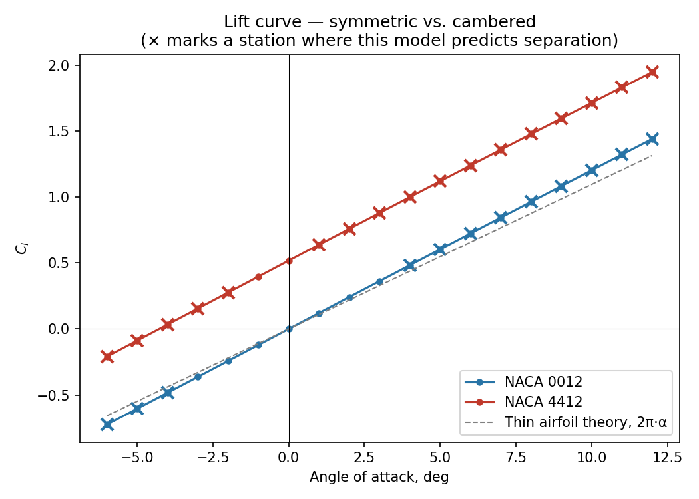
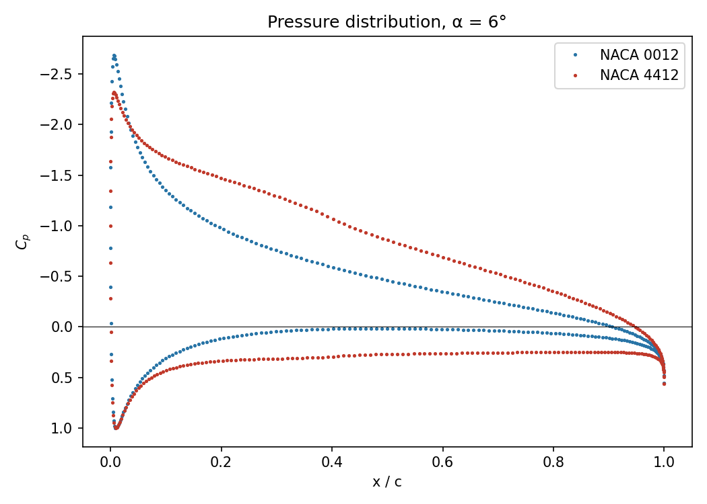
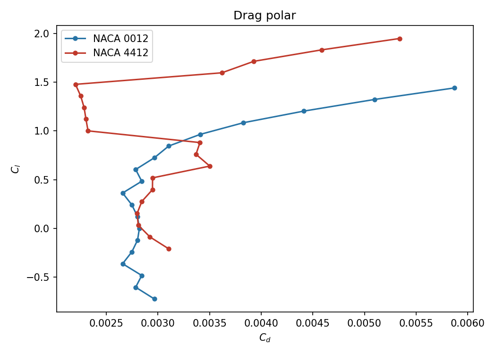
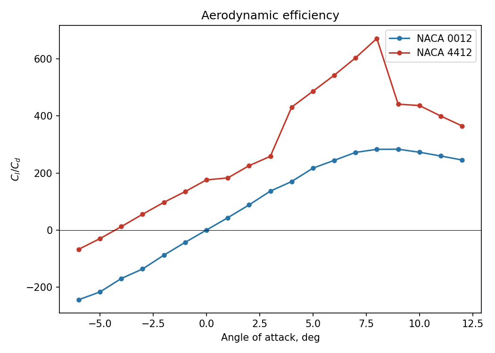
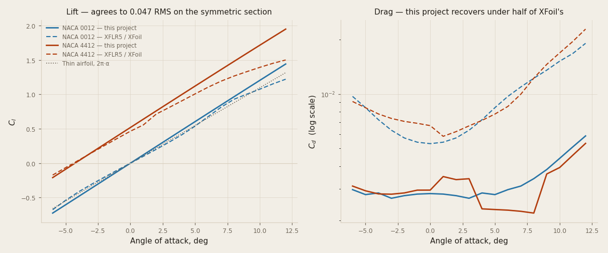

# 01 — Airfoil aerodynamic analysis

A Hess-Smith panel method (inviscid Cl, Cp) coupled to a Thwaites/Michel
boundary-layer estimate (viscous Cd), comparing a symmetric section against
a cambered one — NACA 0012 vs NACA 4412 — the same objective the original
brief for this project set, just built in code rather than driven through
XFLR5's GUI.

**Status:** v1 — panel method validated against four independent closed-form
checks, boundary-layer method validated against the Blasius flat-plate
solution, and the whole thing cross-checked against XFLR5/XFoil: lift agrees
to 0.047 RMS on the symmetric section, drag comes out at 0.41× XFoil's.
That drag gap is real and documented, not a defect discovered late — see
Validation against XFLR5, then Limitations.
**Environment:** system Python 3.13.9, numpy/scipy/matplotlib (already
present — see `../SETUP.md`). No pyOCC. XFLR5 is needed only to *regenerate*
the reference polars, never to use them.

```bash
python -m pytest -q     # 38 tests
python build.py         # solve both airfoils, export polars + figures
```

## Why Python rather than XFLR5

The original brief named XFLR5. Project 04 already made this exact call for
FreeCAD, for the same reason: "a wing clicked into existence in a GUI is not
reproducible, testable, or reviewable in a diff." A panel method is
lightweight enough that there's no equivalent of project 02's hardware
argument for staying in a GUI/cloud tool — an airfoil polar is a solved,
textbook problem, and solving it in code produces something a reviewer can
read the method of, not just the output of.

## Method

**Inviscid — Hess-Smith panel method.** N constant-strength source panels
(satisfy flow tangency; the non-lifting thickness effect) plus a single
shared constant-strength vortex panel distribution (satisfy the Kutta
condition; circulation and lift) — the standard textbook formulation
(Katz & Plotkin; Moran). Solves for Cl and the surface Cp distribution at any
angle of attack, incompressible and inviscid.

**Viscous — Thwaites + Michel + Squire-Young.** The panel method's inviscid
edge-velocity distribution drives a Thwaites' method laminar boundary layer
from the stagnation point along each surface. Michel's criterion flags
natural transition; a flat-plate turbulent correlation (Schlichting) carries
the boundary layer from there to the trailing edge; the Squire-Young formula
turns trailing-edge momentum thickness and shape factor into a profile-drag
coefficient. See `src/boundary_layer.py`'s docstring for exactly which
simplification this makes and why (a flat-plate-equivalent turbulent stage,
not a pressure-gradient-coupled one like Head's method).

## Validation

Four independent checks on the inviscid solver, the same species of
cross-check project 08 runs against its own closed-form limits:

- **Self-induced velocity** — a constant panel's own normal (source) or
  tangential (vortex) velocity on itself is a known closed-form result,
  exactly half the panel's strength. Matched to `1e-9`.
- **Two independent routes to Cl agree** — Kutta-Joukowski circulation and
  direct Cp-integration around the surface, which don't share any code path
  after the linear solve, agree to `0.01` across four angles of attack on a
  cambered section.
- **Lift-curve slope matches the Joukowski thickness correction** —
  2π(1 + 0.77·t/c), not bare 2π: NACA 0012 is 12% thick, and finite
  thickness is known to raise the lift-curve slope above the zero-thickness
  thin-airfoil limit. A first pass checked against bare 2π and failed at
  ~10% high — real physics, not a bug, and the test was checking the wrong
  reference value.
- **Cambered zero-lift angle matches thin airfoil theory** — the closed-form
  integral `alpha_L0 = -(1/π)∫(dyc/dx)(cosθ0 − 1)dθ0`, computed directly from
  the camberline, independent of the panel solve.

And one on the viscous solver:

- **Thwaites matches the Blasius flat-plate solution** — zero pressure
  gradient is the one case an approximate integral method can be checked
  against an *exact* one. Agrees to within 2%, in the direction the
  literature reports for this specific polynomial fit.

Two real bugs the tests caught, not just confirmed the absence of:

- **A sign convention error in the local-to-global panel rotation** — every
  panel's self-induced normal velocity came out as exactly −0.5 instead of
  the textbook +0.5, a uniform sign flip rather than a per-panel error,
  which is what made it findable: local "+y" and the panel's own outward
  normal had been assigned backwards.
- **Kutta-Joukowski Cl came out with the correct magnitude but the wrong
  sign** — caught by checking against unambiguous physics (positive alpha
  on a symmetric section must give positive Cl) rather than by re-deriving
  the rotation by hand a second time. The independent Cp-integration route
  already had the right sign, which is what made the fix obvious rather
  than another round of sign-chasing.

## Results (Re = 1×10⁶)

| | NACA 0012 | NACA 4412 |
|---|---|---|
| Lift-curve slope | 6.93 /rad (theory: 6.86, thickness-corrected) | — |
| Zero-lift angle | 0° (exact, by symmetry) | −4.2° |
| Cl at α = 8° | 0.965 | 1.478 |
| Cd at α = 0° (min, roughly) | 0.0028 | 0.0030 |

Full sweep: `polars/naca0012_re1e+06.csv`, `polars/naca4412_re1e+06.csv`.






## Validation against XFLR5 (XFoil)

The four checks above are closed-form or internal: they confirm the code
implements the mathematics it claims to. None is an independent solver
arriving at a different answer. **XFLR5 v6.62**, which wraps Mark Drela's
XFoil, is that fifth check — and not from the same family of assumptions,
since XFoil couples the inviscid solution and the boundary layer where this
project bolts a drag estimate onto an inviscid result.

Both solvers are given identical geometry, written from this project's own
`Naca4.surface()` rather than XFLR5's NACA generator, so nothing in the
comparison is attributable to a different body. Re = 1×10⁶, NCrit 9, free
transition, α from −6° to 12°. Statistics over −4° to 8°, below where
XFoil's boundary layer begins shedding lift an inviscid method cannot lose:

| | NACA 0012 | NACA 4412 |
|---|---|---|
| Cl, RMS difference | **0.047** | 0.101 |
| dCl/dα, this project | 6.92 /rad | 6.90 /rad |
| dCl/dα, XFLR5 | 6.34 /rad | 5.99 /rad |
| Cd ratio (this ÷ XFLR5) | **0.41×** | 0.38× |

**Lift holds up**, and the lift slopes bracket 2π in the direction the
physics requires — this project above it (thickness adds slope, nothing
removes it), XFLR5 below on the cambered section (viscous decambering takes
back more than thickness gives). Had the inviscid method come out *below*
XFoil, something would be wrong.

**Drag is under-predicted by about 2.5×**, and the shape says why: this
project's Cd is nearly flat with incidence (0.0027 → 0.0059 on the 0012)
while XFoil's more than triples (0.0053 → 0.019). Squire-Young on an
uncoupled Thwaites/flat-plate boundary layer recovers skin friction and
almost none of the pressure-drag rise, because an uncoupled boundary layer
never feeds its displacement effect back into the pressure distribution
driving it. The Limitations section below already said this estimate was
approximate; this is the number.



Full method, conditions and reproduction steps: [`xflr5/`](xflr5/).

## Limitations — read before quoting a Cd number

**The Cl predictions are the well-validated part of this project** — the
panel method is exact potential-flow theory, validated four independent
ways above, and should track real polars closely through the linear,
pre-stall regime (this is exactly what inviscid theory is good at).

**The Cd and separation predictions are a cruder estimate, and it shows in
the figures.** The drag polar and efficiency plots both have a visible
wobble on NACA 4412 around α = 3–9°, right where the model starts flagging
separation on one surface — not numerical noise, but a real artifact of how
crudely the "separated" branch is handled: momentum thickness at the
separation point gets carried through Squire-Young with a fixed nominal
shape factor (H = 2.0) rather than anything that actually tracks how the
shape factor evolves as the separation point migrates with angle of attack,
so Cd doesn't vary smoothly as it should. It's flagged (`upper_separated` /
`lower_separated` on every `PolarPoint`, marked with × on the lift curve)
rather than smoothed over.

**Separation is flagged earlier than a real NACA 0012 actually stalls** (this
model: ~4°; real experimental data: ~15–16° at this Reynolds number). Two
compounding simplifications, both named directly rather than left implicit:
Michel's criterion is a single local correlation, not an amplification-
factor method like XFOIL's e^9 that tracks the actual disturbance-growth
history along the surface, so it under-predicts how early natural transition
protects the boundary layer from separating; and there's no laminar
separation bubble reattachment model, so once Thwaites predicts separation
the method just stops rather than modelling the bubble bursting or
reattaching turbulent, which is what a real boundary layer at this Reynolds
number would often do. The result reads as pessimistic relative to
experiment, and is reported as what this specific, deliberately-simplified
method actually predicts — not tuned to match published polars after the
fact, which would trade an honest limitation for a fabricated one.

## Outstanding

- [x] Hess-Smith panel method — inviscid Cl, Cp, validated four ways
- [x] Thwaites + Michel + flat-plate-turbulent viscous Cd estimate
- [x] NACA 0012 vs NACA 4412 comparison, Re = 1×10⁶
- [x] 38 tests, all passing
- [x] **Cross-check against XFLR5** (v6.62, wrapping XFoil) — done, see
      `xflr5/` and Validation below. Lift agrees to 0.047 RMS on the
      symmetric section; drag comes out at 0.41× XFoil's, which is the
      finding. Reference polars are committed, so the comparison reruns
      with no XFLR5 install.
- [ ] Reynolds sweep (the original brief's third deliverable) — the
      machinery (`polar.sweep(code, alphas, reynolds=...)`) already takes
      Reynolds as a parameter; this is a driver-script addition, not new
      solver work
- [ ] An amplification-factor transition model, to stop under-predicting
      how far natural transition delays separation — a substantially larger
      undertaking than this project's scope (this is most of what makes
      XFOIL XFOIL)
- [ ] A shape-factor correlation through separation, to smooth the Cd wobble
      documented above, instead of the fixed H = 2.0 nominal value

## Log

| Date | What was done |
|---|---|
| 2026-08-21 | Built as an open-source Python alternative to XFLR5, following project 04's precedent for swapping a named GUI tool for scriptable, testable code. `geometry.py` (NACA 4-digit sections, thin-airfoil-theory closed forms), `panel_method.py` (Hess-Smith), `boundary_layer.py` (Thwaites/Michel/Squire-Young), `polar.py` (ties both together per angle of attack), `plotting.py`, `build.py`. Found and fixed a uniform sign-convention bug in the panel rotation (self-induced velocity came out at −0.5, not the textbook +0.5) and a Kutta-Joukowski circulation sign error (correct magnitude, wrong sign, caught against unambiguous physics rather than by re-deriving the rotation again). 23 tests, all passing. Documented the viscous-drag method's real limitations — early separation flagging and a Cd wobble around it — rather than tuning them out. |
| 2026-08-24 | Cross-checked against XFLR5 v6.62 (XFoil) — the first validation here that is an independent *solver* rather than a closed-form identity or an internal second route. Both codes given identical geometry from this project's own `Naca4.surface()`, so no disagreement is attributable to a different body. Lift agrees to 0.047 RMS on the 0012 over −4…8°, and the lift slopes bracket 2π in the direction the physics requires. Drag came out at 0.41×/0.38× of XFoil's, with this project's Cd nearly flat in incidence against XFoil's tripling — an uncoupled boundary layer recovers skin friction and almost none of the pressure-drag rise. Added `src/xflr5_reference.py`, `xflr5/run_analysis.py` (drives XFLR5 in `--script` mode, no GUI interaction), committed reference polars so the comparison reruns without XFLR5, a light/dark validation figure, and 15 tests — including one pinning the drag ratio to 0.2–0.6 so a change to the boundary-layer model fails a test rather than silently moving the README's numbers. |
