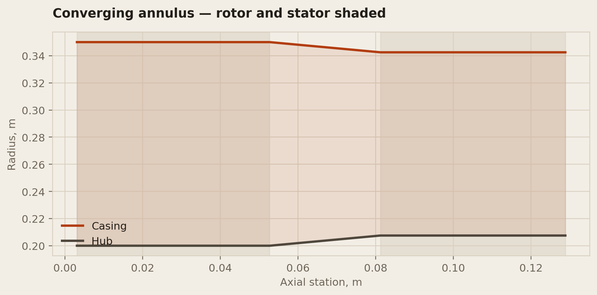

# 06 — Parametric blade row

A rotor-stator compressor stage whose spanwise twist comes from the flow, not
from a shape parameter. The parametric wing (project 04) chose its washout;
this project computes stagger and camber at every radius from a free-vortex
velocity triangle, because that is how an actual compressor blade's twist —
rotor or stator — is decided.

**Status:** v1 — free-vortex rotor and stator twist laws, blade solids, full
annulus assembly for each row, a combined two-row stage, a converging-annulus
variant of that stage, STEP/glTF export, a Carter's-rule deviation
correction, a dimensioned general arrangement drawing and 96 tests are
done. See Outstanding for what's still open.
**Environment:** `conda activate pyocc_env` (Python 3.10, pythonocc-core 7.9.0
— the same environment project 04 uses)

```bash
conda run -n pyocc_env python build.py          # generate and export
conda run -n pyocc_env python -m pytest -q      # 96 tests
```

54 of those 96 tests need no pyOCC at all — `tests/test_velocity_triangles.py`,
`tests/test_blade_section.py`, `tests/test_meridional.py` and
`tests/test_deviation.py` run in any Python with pytest, which is what CI
runs (see `.github/workflows/blade-row-ci.yml` at the repo root — not
inside this project folder, since it's a monorepo-wide GitHub Actions
convention); the OpenCASCADE-dependent geometry tests (`test_blade.py`,
`test_annulus.py`, `test_stage.py`, `test_export.py`, `test_drawing.py`)
only run locally, in `pyocc_env`.

## Why a blade row is a different problem from a wing

A wing's spanwise twist (washout) is a design *choice* — pick 3° tip
pitch-down to delay tip stall, done. A rotor blade's spanwise twist is not a
choice: blade speed `U = omega * r` grows with radius, so a blade that
presented the same angle to the flow everywhere would only be correctly
angled at one radius and progressively wrong on either side of it.

**Free-vortex design** (`r * Cw = const`) is the classical way to pick the
swirl distribution the blade must produce, and it is the one distribution
that makes Euler's specific work, `dW = U * (Cw2 - Cw1)`, come out constant
across the span — anything else asks for a radial pressure gradient the flow
cannot supply without secondary motion. `src/velocity_triangles.py` is that
law and nothing else: inlet swirl `Cw1 = 0` (axial inlet), exit swirl
`Cw2(r) = Cw2_mean * r_mean / r`, and from those, blade speed and axial
velocity give the relative flow angles beta1(r) and beta2(r) a blade at that
radius has to bridge. Stagger is the tangent-mean of the two; camber is their
difference.

That module has no pyOCC import. It is what decides the blade's twist, not
what draws it, and it is exactly what CI runs without the conda environment.

## Why the rotor needs a stator

A rotor alone adds swirl to the flow because that is how it does work —
Euler's `dW = U * Cw2` only comes out nonzero if the rotor leaves the flow
spinning. But nothing downstream (a duct, a combustor, the next rotor) can
use that swirl as useful energy, so a real stage always follows the rotor
with a stationary row that removes it.

`StatorDesignPoint` in the same module is that row's velocity triangle. It
has no blade speed — a stator does not move — so it bridges *absolute* flow
angles instead of the rotor's relative ones: the stator's inlet is exactly
the rotor's exit (`inlet_swirl_mean` is the rotor's `exit_swirl_mean`, the
same number, because the two rows describe one continuous flow), and its
exit swirl defaults to zero — full de-swirl, the usual job of a stage's last
stator. `src/stage.py` is what turns two independently-built `BladeRow`
objects (one driven by each design-point type) into one piece of hardware:
it translates the stator's ring downstream of the rotor's and gives both a
shared hub and casing, since duplicating the flowpath per row would let the
two annuli silently drift apart.

## Design parameters

| Parameter | Symbol | Effect |
|---|---|---|
| Hub / tip radius | r_hub, r_tip | Annulus bounds the blade spans |
| Blade count | Z | Sets solidity with local chord; patterns the full ring |
| Root / tip chord | c_root, c_tip | Linear taper, same convention as project 04 |
| Thickness | t/c | Constant across the span |
| Axial velocity | Ca | Free-vortex design assumption: constant with radius |
| Rotor speed | omega | Sets blade speed U(r) = omega \* r |
| Mean-radius exit swirl | Cw2_mean | Sets stage loading; propagated by r\*Cw=const |

## Reference design

A first-stage-like rotor — hub-to-tip ratio 0.57, 8000 rpm, stage loading
`psi = dW/U_mean^2 = 0.35` — picked to sit in typical subsonic-compressor
ranges rather than to flatter any one number:

| | |
|---|---|
| Hub / tip radius | 0.200 / 0.350 m |
| Blade count | 32 |
| Root / tip chord | 0.062 / 0.052 m |
| Thickness | 6% |
| Axial velocity | 150 m/s |
| Rotor speed | 8000 rpm |
| Specific work | **18 430.7 J/kg — constant across the span, by design** |
| Stage loading psi | **0.347** |

**Rotor** (32 blades, 0.062 / 0.052 m root/tip chord, 6% thick):

| Radius | U | Stagger | Camber | Solidity |
|---|---|---|---|---|
| Hub, 0.200 m | 167.6 m/s | 36.9° | 27.2° | 1.579 |
| Mean, 0.275 m | 230.4 m/s | 51.8° | 11.9° | 1.056 |
| Tip, 0.350 m | 293.2 m/s | 60.2° | 6.0° | 0.757 |

**Stator** (45 blades — no common factor with the rotor's 32, to avoid a
resonant blade-passing excitation between the two rows — 0.050 / 0.045 m
root/tip chord, 8% thick, full de-swirl to zero exit angle):

| Radius | Stagger | Camber | Solidity |
|---|---|---|---|
| Hub, 0.200 m | 20.1° | 36.3° | 1.790 |
| Mean, 0.275 m | 14.9° | 28.1° | 1.237 |
| Tip, 0.350 m | 11.8° | 22.7° | 0.921 |

Both rows' solidity sits within or just outside the typical 0.8–1.5 range —
chord and blade count were picked for one reasonable value at the mean
radius, not jointly optimised across the span. Worth knowing, not worth
hiding: the numbers above are what the design actually produces, not a
rounded-off version of it. The stator's stagger falls with radius for the
same reason its rotor counterpart rises: inlet swirl is free-vortex
(`Cw ~ 1/r`), so the absolute inlet angle it has to bridge shrinks toward
the tip while the rotor's *relative* inlet angle grows with blade speed.

## Converging annulus

A real compressor annulus narrows hub-to-casing along the axial direction to
keep annulus area matched to the gas's falling specific volume as it's
compressed — this stage's stator sits in a smaller-area annulus than its
rotor, not the same one `stage_assembly` requires. `meridional.py`'s
`converging_annulus_exit` holds **mean radius constant** while the flow area
shrinks by a chosen `area_ratio` (exit/inlet) — the standard preliminary-
design convention, since it leaves the free-vortex velocity triangle's own
`mean_radius` untouched, only the span each row's blade is swept across:

| | |
|---|---|
| Area ratio (chosen, not derived — see below) | 0.90 |
| Rotor hub / tip | 0.2000 / 0.3500 m (area 0.25918 m²) |
| Stator hub / tip | 0.2075 / 0.3425 m (area 0.23326 m²) |
| Mean radius | 0.275 m — **unchanged**, by construction |

`area_ratio` is a chosen input sitting in a plausible single-stage subsonic
range (typically 0.85–0.95), **not derived from an actual compression
calculation** — that would need a stage thermodynamic model (density, mass
flow, continuity) this project does not have; project 08's cycle model is
the closer fit for that, applied to a whole engine rather than one isolated
stage. Picking a plausible ratio and building the geometry it implies is
the same "plausible range, not reverse-engineered" standard the rest of
this project's numbers already sit to.

The hub and casing are **three axial segments each** — a cylinder at the
rotor's own radius under the rotor, a cone through the gap, a cylinder at
the stator's own radius under the stator — not one smoothly-varying surface
swept through both rows. That matters because each row's blade sections still
sit at one constant radius per station (this project does not model
streamline curvature *within* a row): a continuously-tapering surface would
have already moved by the time it reached a row's own trailing edge, leaving
that row's blade roots sitting proud of or sunk into a hub/casing that no
longer matched the constant radius they were actually lofted at. The three-
segment construction keeps each row's own flowpath a true cylinder at
exactly its own `BladeRow.hub_radius`/`tip_radius`, the same guarantee
`stage_assembly`'s single shared cylinder already gives — just per row
instead of to one shared surface.



`exports/stage-converging.step` is this stage; `exports/stage.step` (constant
annulus) is unchanged and still what the site's CAD viewer points to — this
is additive, not a replacement.

## Validation

The velocity triangles and the section geometry are checked by identities
that would fail if the physics or the arithmetic were wrong, the same
"independent route" approach project 04 uses for the wing:

- **Constant specific work across the span** — the entire point of a
  free-vortex design; if this varied with radius the "free vortex" label
  would be wrong, not just the test
- **Angular momentum conservation**, `r * Cw2(r) = const`, checked directly
  against the free-vortex definition it comes from
- **Camberline endpoint slopes** are pinned to ±camber_angle/2 by the circular
  arc's own geometry, not just plotted and eyeballed
- **Blade-ring volume = single-blade volume × n_blades** — every copy in the
  ring is a rigid rotation of the same solid, and rotation cannot change
  volume, so this has to hold exactly (checked to 1e-6 relative)
- **Solid validity**, `BRepCheck_Analyzer`, on the blade, the ring, the hub,
  the casing, the single-row assembly and the combined stage
- **Loft convergence** — 5 and 15 radial stations must agree to a few
  percent, not describe visibly different blades
- **Swirl removed is constant across the span** — the stator's analogue of
  the rotor's constant-specific-work identity: both its inlet and exit swirl
  are separately free-vortex, so `r * (Cw_in - Cw_out)` has to be constant
  too, checked the same way `dW` is on the rotor side
- **Stator sits fully downstream of the rotor** — checked on the translated
  bounding box, not trusted from the offset arithmetic that produced it
- **Converging annulus — same two checks, on the cone segment and the
  assembled hub/casing** — a conical frustum's volume is exact closed form,
  `(pi*h/3)*(r1^2 + r1*r2 + r2^2)`, checked against the kernel-built cone
  directly and against the three-segment hub as a sum of two cylinders plus
  one frustum. A cone with equal radii is what caught a real bug here — see
  below. `converging_stage_assembly` also refuses a rotor/stator pair whose
  annulus areas don't actually shrink, the converging-annulus analogue of
  `stage_assembly`'s equal-radius requirement.
- **Carter's rule deviation** — checked against a hand-worked case
  (`carter_deviation_angle` recomputed independently from `m` and `theta`),
  two physical limits (deviation vanishes as `s/c -> 0`, an infinitely
  tight cascade that perfectly guides the flow; `DeviationCorrectedDesign`
  reduces to the base design in that same limit), and monotonicity in both
  `s/c` and camber — a looser cascade or more turning both have to increase
  deviation, not just happen to in one example.

### A real bug this caught

`BRepPrimAPI_MakeCone` raises `Standard_DomainError: cone with two identic
radii` rather than building a degenerate (zero half-angle) cone — a first
version assumed OCC would collapse that case to a cylinder itself, on the
reasoning that a cone with `r1 == r2` *is* geometrically a cylinder. It
doesn't: the caller has to make that substitution. Caught by a test that
built exactly that case rather than only ever passing two different radii.

A second, subtler bug: cutting one three-solid *compound* from another
(the wall-thickness-scaled casing minus the bare flowpath, each a
cylinder-cone-cylinder compound) built without error and reported a
numerically-plausible volume — outer minus inner, correct to six figures —
but `BRepCheck_Analyzer` flagged the result invalid. Cutting a compound of
solids that touch at coincident seam faces (where each cylinder meets its
cone) is not the same operation as cutting three genuinely separate solids,
and the volume number alone didn't catch that the topology was wrong. Fixed
by cutting each of the three segments individually — matching the
single-solid cut `casing_shell` already used — then compounding the three
already-hollow results, rather than compounding first and cutting once.
This is exactly why solid validity is checked directly rather than inferred
from a volume number agreeing: a shape can have the right volume and still
be the wrong shape.

## Exports

STEP in millimetres, glTF in metres — same reasoning as project 04's
export.py: most mechanical CAD assumes mm regardless of what the file
declares, and glTF's own convention is metres.

`exports/blade_row.step` is the hub, the full 32-blade rotor ring and the
casing shell as one assembly — unchanged, so it's still what the site's CAD
viewer points to. `exports/stage.step` is the fuller picture: rotor ring,
stator ring translated downstream by half the rotor's mean chord, and one
shared hub and casing spanning both — 40 959 entities against the rotor
alone's 17 221. `exports/stage-converging.step` is the same stage with the
converging annulus described above — 41 633 entities, a rotor and stator
in genuinely different (but consistent) annuli rather than a shared one.
`exports/blade_row-deviation-corrected.step` is the rotor ring built from
Carter's-rule-corrected stagger/camber instead of the base tangent-mean
angles — a separate export, not a replacement: `exports/blade_row.step`
is unchanged and still what the site points to.

## Figures

`figures/velocity-triangles.png` — stagger rising and camber falling across
the span, crossing near the mean radius, which is the whole spanwise-twist
story in one plot.

`figures/hub-tip-sections.png` — hub and tip sections overlaid at true
relative scale and stagger. Without it, "27° of camber at the hub against 6°
at the tip" is two numbers; with it, it's visibly a fatter, less-staggered
blade at the hub against a flatter, more-staggered one at the tip.

`figures/meridional-flowpath.png` — hub and casing radius against axial
station: flat under each row, sloped through the gap between them, the
rotor and stator's own axial extents shaded so the taper reads against the
hardware that actually sits in it rather than as an abstract curve.

`figures/deviation-comparison.png` — blade camber angle against radius,
tangent-mean rule against Carter's-rule-corrected, the gap between the two
curves drawn rather than left as a single deviation-angle number.

`drawings/blade-row-ga.png` — dimensioned general arrangement, in the
style of project 04's: a meridional view, a hub-section cascade detail,
and a blade-angle schedule table carrying stagger/camber/solidity at hub,
mean and tip — the standard way a real turbomachinery drawing shows a
spanwise-twisting blade a single 2D section can't.

## Outstanding

- [x] Free-vortex rotor velocity triangles, tested without pyOCC
- [x] Free-vortex stator velocity triangles, tested without pyOCC
- [x] Circular-arc blade section, tested without pyOCC
- [x] Single blade solid, lofted through radial sections
- [x] Full annulus: blade ring patterned about the engine axis, hub drum,
      casing shell
- [x] Rotor-stator stage: stator ring translated downstream, shared hub and
      casing
- [x] STEP + glTF export, single row and combined stage
- [x] 96 tests, CI on the pyOCC-free half
- [x] **Converging annulus** — `meridional.py` (pyOCC-free: the area/radius
      arithmetic) and `annulus.converging_hub_solid`/`converging_casing_shell`
      plus `stage.converging_stage_assembly` (pyOCC) build a stage whose
      stator sits in a genuinely smaller-area annulus than its rotor, hub
      rising and casing falling while mean radius stays fixed. See the
      Converging annulus section above for the design choice (a chosen area
      ratio, not a derived one) and why the hub/casing are three segments
      rather than one continuously-tapering surface. `stage_assembly` and
      `exports/stage.step` are untouched — this is additive, and a constant
      annulus is still a legitimate, already-in-use v1 scope.
- [x] **Deviation correction** (Carter's rule) — `deviation.py`, pyOCC-free:
      `carter_deviation_angle` (the standard circular-arc-cascade form,
      `delta = m*theta*sqrt(s/c)`, `m = 0.23 + beta2/500`) and
      `DeviationCorrectedDesign`, a wrapper that duck-types the same
      `stagger_angle`/`camber_angle` interface `RotorDesignPoint` and
      `StatorDesignPoint` already do — so a `BladeRow` built with a
      wrapped design gets deviation-corrected geometry with no change to
      `blade.py` or `velocity_triangles.py` at all. Single-pass, not
      iterative (see the module docstring for why that's the standard
      preliminary-design approximation, not a shortcut). On the reference
      rotor: 5.9°/3.7°/2.4° deviation at hub/mean/tip — see
      `exports/blade_row-deviation-corrected.step` and
      `figures/deviation-comparison.png`. `exports/blade_row.step` is
      unchanged.
- [x] **Dimensioned general arrangement drawing**, in the style of project
      04's `drawing.py` (reimplemented, not imported — each project stays
      self-contained) — `src/drawing.py`: a meridional view, a hub-section
      cascade detail, and a blade-angle schedule table for the spanwise
      twist a single 2D section can't show. See `drawings/blade-row-ga.png`.
- [ ] **Get an Autodesk viewer link for the compressor stage model** — not
      an embed: `app/components/CadViewer.js` already documents why
      embedding `viewer.autodesk.com` is impossible (`X-Frame-Options:
      DENY`, a policy on Autodesk's side, not something to work around),
      and the site moved to self-hosted glTF rendering instead. What
      `CadViewer` *does* still support is an optional external link —
      project 04's wing model already has one
      (`href: "https://autode.sk/4xSGusM"` in `app/data.js`'s
      `cadModels`), project 06's "Compressor stage" entry does not.
      Getting one needs uploading `exports/stage.step` to Autodesk's
      viewer and copying the resulting share link — an account-based
      third-party service I can't operate; needs the repository owner
      directly, the same as project 02's SimScale block.
- [x] Wire `exports/stage.glb` into the site's CAD gallery — replaces the
      rotor-only model; the switcher shows the stator visibly offset
      downstream of the rotor, not just a bigger single ring

## Log

| Date | What was done |
|---|---|
| 2026-08-22 | Deviation correction and GA drawing — two of the three remaining Outstanding items. `deviation.py` (pure Python, no pyOCC): `carter_deviation_angle` (the standard circular-arc-cascade form) and `DeviationCorrectedDesign`, a wrapper duck-typing `RotorDesignPoint`/`StatorDesignPoint`'s own `stagger_angle`/`camber_angle` interface, so a `BladeRow` built with it gets Carter's-rule-corrected geometry with zero changes to `blade.py` or `velocity_triangles.py`. Caught a test-tuning bug in my own first draft: a limiting-case test used `space_chord_ratio=1e-6` with an absolute tolerance of `1e-6` radians, not accounting for the formula's own `sqrt(s/c)` scaling — fixed by using `1e-12`, the same "the test's own numbers need checking, not just the code's" habit this project already holds itself to. `src/drawing.py` (reimplemented in the style of project 04's `drawing.py`, not imported — self-containment) draws a meridional view, hub-section cascade detail and a blade-angle schedule table; first render had the tip-chord dimension overlapping the sheet's own title text, and the hub/tip radii were briefly labelled as diameters while the rest of the sheet quotes radii — both caught by actually looking at the rendered PNG rather than trusting it compiled. New exports: `exports/blade_row-deviation-corrected.step`/`.glb`, `figures/deviation-comparison.png`, `drawings/blade-row-ga.png` — `exports/blade_row.step` and everything the site already points to are unchanged. The third item (an Autodesk viewer link for the compressor stage) is blocked on the same "can't operate a third-party account-based service" constraint as project 02's SimScale item — see Outstanding for exactly what's needed. 17 new tests, 96 total. |
| 2026-08-21 | Converging annulus. `meridional.py` (pure Python, no pyOCC): `converging_annulus_exit` holds mean radius constant while flow area shrinks by a chosen area ratio, `cone_frustum_volume` its closed-form check. `annulus.py` gained a cone-segment primitive and three-segment hub/casing builders (cylinder-cone-cylinder, not one continuously-tapering surface — see the README section for why); `stage.py` gained `converging_stage_assembly` for a rotor and stator in genuinely different annuli. Found and fixed two real bugs: `BRepPrimAPI_MakeCone` raises rather than degenerating to a cylinder when both radii are equal (a first version assumed the collapse happened automatically); and cutting one three-solid compound from another built without error and gave a numerically-plausible volume but an invalid result — fixed by cutting each of the three segments individually, then compounding the already-hollow pieces, which is what the "check validity directly, don't infer it from a volume number" habit the rest of this project already holds itself to was for. Also added `tests/test_meridional.py` to the CI workflow's explicit test list (`.github/workflows/blade-row-ci.yml`) — it's pyOCC-free and CI-eligible, but the workflow names test files rather than globbing a directory, so a new pyOCC-free test file doesn't get picked up automatically. 24 new tests, 79 total, all passing. `stage_assembly` and `exports/stage.step` untouched. |
| 2026-08-20 | `StatorDesignPoint` (pure Python, no pyOCC) — absolute-frame velocity triangle for a stationary row, inlet swirl equal to the rotor's exit swirl by construction, defaulting to full de-swirl. `stage.py` translates a stator `BladeRow` downstream of a rotor `BladeRow` and gives both a shared hub/casing; `annulus.py`'s hub/casing builders gained an explicit axial-range override to make that possible without duplicating flowpath surfaces per row. Reused `BladeRow` unchanged for the stator — it only ever calls `design.stagger_angle`/`camber_angle`, so a `StatorDesignPoint` duck-types straight in. 45 stator blades against the rotor's 32, no common factor, to avoid resonant blade-passing excitation. Full stage verified end to end: 40 959-entity STEP, valid glTF, 55 tests passing. |
| 2026-08-20 | `velocity_triangles.py` and `blade_section.py` (pure Python, no pyOCC), `blade.py` (single-blade loft), `annulus.py` (blade ring + hub + casing), export and figures. Full build verified end to end in `pyocc_env`: 17 221-entity STEP, valid glTF, 40 tests passing. First working draft — see Outstanding for what is deliberately not done yet. |
