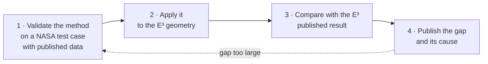
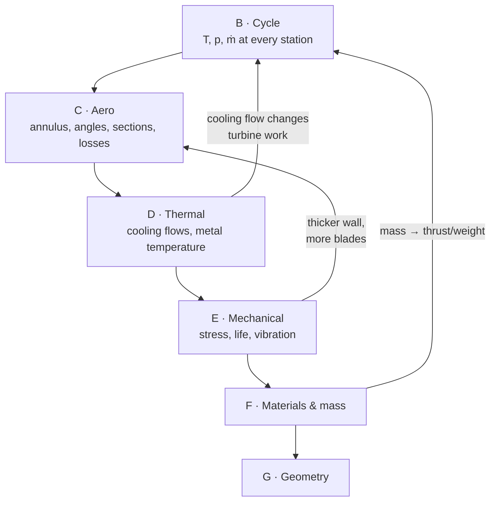

# Work plan — PF-09

**Ten stages, forty-one phases, roughly 510 hours.** A no-compromise rebuild
of the NASA/GE Energy Efficient Engine: every discipline taken to the
fidelity the published data can check, every method validated on a NASA test
case before it is applied, every result compared against what NASA measured.

This replaces the 108-hour plan of 3 September, which produced a checkable
*shape*. This produces a checkable *design*.

> [!important] The one rule that outranks this document
> The twenty-minute weekly job block comes first, every week, without
> exception. This project makes an interview go well. It does not produce
> one. Five hundred hours with zero applications sent is a failure.

---

## What "close to real" means here, precisely

Three levels of fidelity, and the level this plan commits to per discipline.

| Level | Meaning | Example |
|---|---|---|
| **L1 Geometric** | it looks like the component | the reference model in the screenshot |
| **L2 Parametric** | the numbers are right at stage level, from the source | HPC Table X transcribed: 28 blades, r_tip 35.08 cm, stagger 65.2° |
| **L3 Physical** | an analysis with a *validated* method reproduces the published performance to a stated tolerance | mean-line with SP-36 losses gives HPC η_ad within 1 point of Table XIV's 0.860 |

**Commitment:** L3 wherever the E³ publishes a result to check against.
L2 wherever it publishes geometry but no result. Where it publishes neither
(fan blade sections), a stated assumption produced by a validated method.
No discipline is left at L1.

## The validation ladder

No analysis is trusted on the E³ until it has reproduced a published NASA
result on a case built for the purpose. Every method climbs the same four
rungs, in order:

| Method | Rung 1 — validate on | Rung 3 — compare with |
|---|---|---|
| Compressor loss / deviation / DF | NACA TN 3916 65-series cascades | HPC Tables XIV, XV; Table X angles |
| Compressor CFD | NASA Rotor 37 (TP-1337, CFD-validation report) | HPC rotor 1 loss and turning |
| Turbine loss | Ainley–Mathieson R&M 2974 worked cases; SP-290 | HPT Table III, LPT Table I efficiencies |
| Through-flow / radial equilibrium | SP-36 ch. VIII; HPT report Fig. 5 | HPC Table XXI stator vector diagrams |
| Internal cooling correlations | TP-2232 data | HPT report Figs. 27, 33, 35 metal temperatures |
| Blade and disc FEA | CAD-05's converged bracket; HPT report Figs. 61–72 | HPC Table X root stresses; HPT disc LCF |
| Campbell | HPC report Figs. 33–42 (all ten stages published) | same |
| Cycle | closed-form ideal cycle (PF-08 already) | Table XII, three rating points |

## The flaws in the reference model, and where each is designed out

| Flaw in the screenshot | Why it is wrong | Designed out in |
|---|---|---|
| Blades read as untwisted plates | a real blade turns ~30° hub to tip because r·c_θ is held | C2 through-flow, C3 sections from Table XXII |
| LPT flares into a bell | E³ LPT outer wall slopes 25°, not 60°; annulus grows with expansion, not by eye | B4 annulus from the cycle, A3 digitised Fig. 32 |
| No bearings, shafts float | five bearings, two sumps, an intershaft roller — a tenth of the engine's mass | E4, H3 |
| Combustor is a gap | double-annular, 60 cups, 30 nozzles, shingled liner, 48/52 prediffuser | D2, G3 |
| No flanges, no module joints | the engine is built and maintained in modules | H2 |
| Proportions from a photograph | nothing knows what the engine is for | B (all), C1 |
| No clearances | 1 % of span costs 1–2 % efficiency; E³ ran ACC to hold 1.0 / 0.6 % | D4, H4 |
| Single material, no temperature | Ti runs out at 500 °C; the E³ switches to Ni between HPC stages 6 and 7 | F1 |
| Nothing can be checked | every number here has a page, a test, or a stated tolerance | all |

## The discipline loop

The stages are not a line. Aero sets the geometry, thermal sets the metal
temperature, mechanical sets the wall thickness, materials set the
allowable, mass feeds back into the cycle through the aircraft — and a
change anywhere re-runs everything downstream. `build.py` is the loop.

---

## Budget

| Stage | What it produces | Hours | CAD? |
|---|---|---|---|
| **A** Foundation | every source on disk; every table transcribed; topology asserted | 40 | no |
| **B** Thermodynamic design | validated cycle at three ratings, with mixer, secondary air and real gas | 40 | no |
| **C** Aerodynamic design | mean-line, through-flow, sections, CFD — each validated, each compared | 120 | no |
| **D** Thermal design | HPT cooling reproduced; combustor; secondary-air map; clearance control | 60 | no |
| **E** Mechanical design | blades, discs, vibration, shafts, bearings, attachments — with FEA | 90 | no |
| **F** Materials and mass | alloys with allowables at temperature; mass per module | 20 | no |
| **G** Geometry generation | every part generated from the validated design tables | 40 | no |
| **H** Hand CAD and assembly | structure, sumps, joints, motion, section | 50 | **yes** |
| **I** Whole-engine verification | cross-discipline consistency; `FINDINGS.md` | 30 | partly |
| **J** Publication | site, drawings, the write-up | 20 | no |
| | | **510** | 50 in a GUI |

At ten hours a week this is a year; at twenty, six months. **Stages A–F need
no CAD licence** and are 370 of the 510 hours. Each stage is a publishable
result in itself; the plan is ordered so that stopping after any stage
leaves a complete piece of work.

---

# STAGE A — Foundation · 40 h

## A1 · Every source on disk · 4 h
- [x] `fetch-sources.sh` — 41 documents across every discipline, all
      public domain or openly published; `--check` lists what is missing
- [ ] Run it; confirm every file is a PDF and readable as page images
- [ ] Record each report's front-matter page offset in `DATA-INDEX.md`

*Closes when:* `./fetch-sources.sh --check` reports zero missing.

## A2 · Transcribe the tables completely · 24 h
The blade-level data is what separates L2 from L1. All of it goes into
`data/`, every value with a page, every table with a consistency test.
- [x] CR-168219 Tables XI–XV, XVIII, XXI, XXIII, XXVI; §4.3, §5.1–5.8
- [x] HPC Table X — per-stage rotor summary, all ten stages
- [x] HPT Tables I–IV; Fig. 3 dimensioned flowpath; Fig. 1 annulus areas
- [x] LPT Table I; bearing arrangement; combustor counts; mixer
- [x] **HPC Table XXII** pp. 154–159 — section geometry for all ten rotors
      **and the IGV and all ten stators**: 252 sections, each with radius,
      chord, camber, stagger, β1*, β2*, tm/c, %c, te/c. Every row checked
      camber = β1*−β2* and cm = in × 2.54; ends checked against Table X;
      stator 10 checked against Table XXI. `data/hpc-blade-sections.yaml`,
      `tests/test_hpc_sections.py`
- [x] **HPC Table XXI** pp. 112–132 — every row's through-flow: 12
      streamlines at inlet and exit, blade-element solidity, DF, loss,
      efficiency, incidence, deviation. 21 rows, 756 station lines. Checked
      five ways (R-BAR vs XXII, U/r = ω = 12,303 rpm, PT/TT chaining along
      the gas path, σ = cN/2πr, DF recomputed). Found: both bleed ports in
      the data where the prose puts them; rotors 9 and 10 re-bladed 88→86
      and 98→94 between original and final; stators 8–9 re-chorded.
      `data/hpc-vector-diagrams.yaml`, `tests/test_hpc_vector_diagrams.py`
- [ ] HPC Figs. 10–20 — stagewise aspect ratio, solidity, Mach, swirl,
      temperature rise, diffusion factor, work input; Fig. 15 CAFD flowpath
- [ ] HPC Table XVI clearances; Table XVII casing bolting; Figs. 61–62
- [x] **HPT report §3 cooling** pp. 17–67 — the T41 margin budget; the
      18.87 % flow budget and its four sums; supply system; stage-1 vane
      (cavity pressures, backflow margins, impingement and film geometry
      row by row, 14-node pitch map, mixing losses per row); stage-1 blade
      (two circuits and six exits both closing on 3.30 %, tip cap, flow
      characteristics, 43-node pitch map in °C and °F, transient); both
      shrouds; stage-2 vane (flows closing two ways, 58 nodes at two spans);
      stage-2 blade (23 nodes, FOD and tip-cap-loss analyses); rotor
      structure and casing thermal fixes; casing 22-node map.
      `data/hpt-cooling.yaml`, `tests/test_hpt_cooling.py`. Five print
      inconsistencies and eight °C/°F read disagreements on the record
- [ ] HPT report Figs. 44–47 — blade-tip and interstage-seal clearances
      (in §4, not §3)
- [ ] HPT report §5.2.1 — every disc, shaft and retainer: geometry, stress,
      LCF; Figs. 51–52 materials; Fig. 5 flow angles and energy vs span
- [x] **LPT blade counts per stage** — 120 122 122 156 110 (Fig. 52), with
      chords, lengths, aspect ratios; Table VIII takeoff stresses; Table IX
      rupture mission; life and HCF results; stage-1 Campbell; materials;
      design speeds (Table VI 3,539 rpm confirms the cycle derivation).
      `data/lpt-design.yaml`, `tests/test_lpt_design.py`
- [ ] LPT report §2.5–2.7 — final flowpath, vector diagrams, blade shapes
      per stage; §4.2.2–4.2.3 dovetails and discs; §4.3 stator (vane
      counts 3–5); Table X LCF
- [ ] Fan hardware report CR-165148 — blade sections if published, shroud,
      dovetail, containment
- [ ] Combustor report 19900019238 — liner geometry, dome, hole patterns,
      cooling flow split, exit profile, emissions
- [ ] E³ HP turbine cooling model 19810018555 — the cooling design method
- [ ] ICLS CR-168211 — measured engine performance: the *tested* numbers
      against which the FPS *design* numbers can be compared

*Closes when:* every table in `DATA-INDEX.md` marked **L** is marked **T**,
and `tests/test_published_data.py` holds every new table to at least one
independent cross-check.

## A3 · Digitise every flowpath · 8 h
- [ ] Fan and booster — CR-168219 Fig. 13, scaled to 2.11 m; fan hardware
      report may give dimensions directly
- [ ] HPC — HPC report Fig. 15 CAFD flowpath against Table X radii
- [ ] Combustor — Fig. 22, and the combustor report
- [ ] HPT — already dimensioned (HPT Fig. 3); confirm against CR-168219 Fig. 24
- [ ] LPT — LPT report Fig. 6 (final Block II) and CR-168219 Fig. 32
- [ ] Transition duct, mixer, nozzle — Figs. 39, 40
- [ ] Whole engine — Fig. 1 as the master; every component must land on it
- [ ] State a digitising uncertainty per figure from pixel size and line weight

*Closes when:* one `flowpath.stations` list runs fan face to nozzle with hub
and tip at every row LE/TE, and the HPT segment agrees with the dimensioned
Fig. 3 to within the stated uncertainty.

## A4 · Topology, asserted · 4 h
- [x] Gas path, station convention, crossed spools, power balance, bearings
- [x] `tests/test_topology.py`, `tests/test_published_data.py` — 37 tests
- [ ] Extend: every bleed source and sink; every cavity; every bearing's
      load path to a casing — as data, with tests

*Closes when:* the secondary-air and load-path graphs are data, and no
component, bleed or bearing can be placed inconsistently without a test failing.

---

# STAGE B — Thermodynamic design · 40 h

The cycle is the root of everything downstream; it has to be right at three
rating points, not one, and it has to carry the flows the real engine carries.

## B1 · Mixed-flow cycle · 12 h
- [ ] Add a mixer model to PF-08: constant-area or constant-pressure mixing
      of core and bypass, mixing effectiveness as an input (E³: 0.838
      Table XI; 0.85 FPS projection Table XXIII), duct losses per Table XI
- [ ] Single C-D nozzle with the published coefficient 0.996
- [ ] Two fan pressure ratios — bypass and hub streams — as the E³ quotes them
- [ ] Real-gas properties: cp(T) for air and for products at the
      fuel–air ratio; PF-08 `gas.py` extended, not replaced

*Closes when:* the mixer model reproduces Table XXIII's sfc improvement of
2.9 % for 85 % effectiveness against a separate-flow baseline of the same
core.

## B2 · Secondary air in the cycle · 8 h
- [ ] Every Table XI stream at its published fraction and its published
      source and sink: CPD nonchargeable (upstream of vane-1 throat),
      CPD chargeable (downstream), stage 7 → HPT vane 2, stage 5 → LPT
- [ ] Chargeable vs nonchargeable handled correctly in turbine work
- [ ] Zero customer bleed and power extraction, 100 % ram — as the report

*Closes when:* turbine work per spool changes by the amount the cooling
bookkeeping predicts, and the HPT work split still lands at 56.5 % stage 1.

## B3 · Three rating points · 12 h
- [ ] Max climb (the match point), max cruise, sea-level takeoff at the
      flat-rating temperatures in §4.4
- [ ] Component maps or scalings so off-design points follow from the
      match point rather than being re-matched — PF-08 `off_design.py`
- [ ] Reproduce all seven rows of Table XII at all three points

*Closes when:* sfc, OPR, BPR, both FPRs, HPC PR and T41 agree with Table XII
at all three points to a tolerance stated **before** the run — and the
tolerance is the same at all three. A model tuned to one point and off at
the others has been tuned, not validated.

## B4 · Station properties and the annulus · 8 h
- [ ] T, p, ρ, ṁ, c_x, Mach at every station in `flowpath.stations`
- [ ] Annulus area by continuity at the axial Mach each row was designed to
      (HPC report Fig. 12 pitch-line meridional Mach; HPT Fig. 5)
- [ ] Computed hub/tip against digitised hub/tip — **the meridional plot**

*Closes when:* the computed annulus lies inside the digitising uncertainty
of NASA's at every station where NASA's is dimensioned (HPT), and the
disagreement elsewhere is quantified and explained.

---

# STAGE C — Aerodynamic design · 120 h

Four fidelity rungs per component: mean-line, through-flow, sections, CFD.
Each validated before applied. Each compared with the E³ published result.

## C1 · Mean-line with loss models · 32 h
- [ ] **Compressor loss and deviation** per SP-36: profile loss vs DF,
      end-wall and tip clearance loss, Carter deviation with the SP-36
      corrections, incidence range. **Validate on NACA TN 3916** cascades
      before touching the E³
- [ ] **Turbine loss** per Ainley–Mathieson R&M 2974 (profile, secondary,
      tip clearance, trailing edge), with the SP-290 vol. 2 method as the
      cross-check. Validate on the worked cases in the report
- [ ] Stage-by-stage HPC: work split, DF per row, de Haller, stall margin
      estimate, VSV schedule effect. Compare stagewise with HPC report
      Figs. 14, 17, 18, 27
- [ ] Fan and quarter-stage: bypass and hub streams separately, island
      split 22 %, 42 % return
- [ ] HPT: two stages at 56.5 / 43.5 % work, cooled-turbine efficiency
      definition matching the report's (thermodynamic vs primary)
- [ ] LPT: five stages, loading and flow coefficient per stage, stage 4
      acoustic gap
- [ ] **Derive the stage counts** from loading limits, then compare with
      1 / ¼ / 10 / 2 / 5

*Closes when:* HPC η_ad within **1.0 point** of 0.860 (Table XIV); fan
bypass and hub η within 1.0 point of Table XIII; HPT η within 0.5 point of
92.4 %; LPT within 0.5 point of 91.7 % (LPT Table I). Tolerances are the
scatter of the loss correlations, not a fit.

## C2 · Through-flow · 24 h
- [ ] Radial equilibrium (simple, then with streamline curvature) per
      SP-36 ch. VIII, at each blade row LE and TE
- [ ] Reproduce the **radial distributions** in HPC Table XXI — stator
      inlet and exit: radius, PR, TR, Mach, c_z, α at 12 spanwise stations
- [ ] Reproduce HPT report Fig. 5 — flow angles, Mach and energy
      extraction vs span, which is forced-vortex, not free
- [ ] LPT vector diagrams per LPT report §2.6 — controlled vortex

*Closes when:* the through-flow reproduces Table XXI's stator-10 exit
swirl and Mach distributions within 2° and 0.02 across the span, and the
HPT energy-extraction profile shape of Fig. 5.

## C3 · Blade sections · 32 h
- [ ] **Reconstruct every HPC rotor section** from Table XXII: camber line
      from camber angle and family (Special / bi-convex / 65-series),
      thickness from tm/c, %c, te/c; stagger; twelve sections per rotor
      stacked on the stacking axis with the published pretwist and tilt
- [ ] HPC stators from Table XXI section data; vane counts
- [ ] HPT vanes and blades: digitise Fig. 6 hub/pitch/tip shapes; check
      Zweifel and solidity against Table IV
- [ ] LPT: digitise LPT report Figs. 9–18 per stage
- [ ] **Fan blade — not published.** Design it: transonic outer sections
      by the SP-36 / AGARD LS-167 method for tip relative Mach 1.4, hub
      sections subsonic, 12 stream surfaces, 32 blades, part-span shroud at
      50 %. State that it is designed, not transcribed
- [ ] Booster rows and inner OGV with the published sweep 60° / lean 0–20°
- [ ] Throat area per row from the sections; check it passes the station
      mass flow at the design Mach

*Closes when:* every row's section set reproduces the published chord,
camber, stagger and thickness within transcription precision, and every
throat passes its flow.

## C4 · CFD, selectively · 32 h
Not every row. The rows where a loss correlation is least trustworthy, and
only after the method is validated.
- [ ] **Validate OpenFOAM on NASA Rotor 37** (TP-1337 geometry, the CFD
      validation report as the reference): mesh convergence, pressure
      ratio and efficiency vs mass flow, spanwise profiles. PF-05's GCI
      discipline applies
- [ ] HPC rotor 1 (transonic, 28 blades): loss, turning, shock position
      vs the mean-line and Table X/XXII
- [ ] HPT stage-1 vane: exit angle and Mach vs Table III / Fig. 5
- [ ] One LPT stage, for the high-aspect-ratio secondary-flow loss
- [ ] Feed the CFD losses back into C1 and re-close

*Closes when:* Rotor 37 pressure ratio and efficiency at design flow land
within the published experimental scatter, and the E³ row results move the
mean-line prediction *toward* the published efficiency, not away.

---

# STAGE D — Thermal design · 60 h

## D1 · HPT cooling, reproduced · 24 h
- [ ] Flow network per row from the HPT report §3 and the E³ cooling model
      report: supply pressure, orifice, internal passages, film rows, tip
      cap, TE slots — with the published cooling flow fractions
- [ ] Internal heat transfer from TP-2232 correlations (validated against
      the data in that report), external from the report's own
      coefficients (§5.4.4: below CF6-based values, especially pressure side)
- [ ] Film effectiveness by row; superposition
- [ ] Metal temperature distribution, stage 1 blade pitch section, at
      steady-state takeoff — compare with HPT report Fig. 27; vane Fig. 16;
      stage 2 Fig. 35
- [ ] TBC effect on the dome and shingles (combustor) and on the HPT
- [ ] Transient: Fig. 28 — the thermal gradients that drive LCF

*Closes when:* pitch-section metal temperature within **25 K** of the
published distribution at three chordwise points, with the published
cooling flow, not a tuned one.

## D2 · Combustor · 12 h
- [ ] Liner cooling: impingement + effusion per shingle row, from the
      combustor report; wall temperatures
- [ ] Exit temperature profile and pattern factor — the HPT vane's input
- [ ] Loading, residence time, primary-zone equivalence ratio at the three
      rating points; pilot-only vs both domes
- [ ] Emissions estimate against Tables XVI–XVII, method from AGARD CP-422

*Closes when:* pressure drop 5.0 % reproduced from the geometry, and the
exit profile is what D1 used.

## D3 · The secondary-air map · 16 h
- [ ] Every bleed, cavity, seal and sink as a network: sources (fan, stage
      5, stage 7, CPD), pressures, flows, temperatures at max climb and TO
- [ ] Rim seals: purge vs ingestion margin at each disc cavity
- [ ] Labyrinth seal leakages from clearance and pressure ratio
      (sealing report); sump pressurisation (§5.7)
- [ ] **Thrust balance** on each rotor across the mission; balance-piston
      cavities per HPT report Figs. 95–96; net load into bearings 1 and 3
- [ ] Rotor bore cooling with fan discharge air (§5.2.2)

*Closes when:* total secondary air lands at Table XI's 16.1 % of W25 and
every cavity has a pressure that keeps hot gas out.

## D4 · Clearance control · 8 h
- [ ] Casing and rotor thermal growth vs time through takeoff–climb–cruise
- [ ] ACC: fan-air impingement effect on HPT/LPT casing; the CPD warm-up
      circuit
- [ ] Reproduce HPT report Figs. 44–47: tip clearance vs time with and
      without ACC; the 1.0 / 0.6 % steady values

*Closes when:* the clearance transient has the published shape and the
cruise values land within 0.2 % of span.

---

# STAGE E — Mechanical design · 90 h

## E1 · Blades · 24 h
- [ ] Centrifugal stress per row from the C3 sections — area distribution,
      taper, stacking; compare with HPC Table X `centrifugal_stress` all
      ten stages
- [ ] Gas bending from the C1 loads; tilt to cancel; compare Table X
      `max_root_stress`
- [ ] **FEA in CalculiX** on HPC rotor 1, HPT blade 1, LPT blade 1: mesh
      convergence as CAD-05 did it; peaks on constraints disbelieved
- [ ] HPT blade creep: Larson–Miller with the D1 metal temperatures;
      rupture life vs the report's BUCKET-CREEP result (Figs. 75–76, 83–84)
- [ ] HPT blade LCF from the D1 transient (Fig. 78)

*Closes when:* Table X centrifugal stresses reproduced within **10 %** all
ten stages, and HPT stage-1 rupture life within a factor of 2 of the
published — that is the scatter of creep data.

## E2 · Discs · 20 h
- [ ] Disc profiles from the cross-sections (A3) for every rotor stage
- [ ] Rim load = blade count × blade CF + attachment; bore stress; burst
      margin on average tangential stress at 120 % speed (33.27 / CS-E 840)
- [ ] **FEA** on HPT stage-1 disc; compare with HPT report Figs. 61–64;
      interstage seal disc Fig. 65
- [ ] LCF at bore and slot (Fig. 61 gives concentration and life)
- [ ] The bolted-joint and inertia-weld rotor structure of the HPC

*Closes when:* HPT disc peak effective stress within 10 % of Fig. 64, and
the bore doubling for a small hole is demonstrated on the model.

## E3 · Vibration · 20 h
- [ ] Blade modal analysis per HPC stage; **Campbell diagrams vs HPC report
      Figs. 33–42** — ten published diagrams to match, with the stage-3
      root-thickening for 4/rev as the test
- [ ] Vane Campbell vs Figs. 46–56
- [ ] LPT stage 1 coupled blade–disc (LPT report Fig. 63); tip-shroud and
      angel-wing effects
- [ ] Flutter screen: reduced frequency per row; flexural and torsional
      stability plots vs HPC Figs. 43–44
- [ ] HCF margin by Goodman on top of the E1 mean stress

*Closes when:* first three modes of every HPC stage within **5 %** of the
published Campbell lines.

## E4 · Shafts, bearings, rotordynamics · 16 h
- [ ] LP and HP shaft torsion and bending; the LP shaft through the HP
      spool with clearance
- [ ] Bearing loads: radial from mass and unbalance, axial from D3 thrust
      balance; check against bearing type (ball 1, 3; roller 2, 4, 5)
- [ ] Critical speeds of each rotor with bearing stiffness; squeeze-film
      damper effect (CR-168219 §5.11, Figs. 56–57)
- [ ] Blade-out unbalance load into mounts (§5.9.2; 33.94 / CS-E 810)

*Closes when:* no rotor critical inside the operating band without a
damper, and thrust-bearing load stays inside capacity in both directions.

## E5 · Attachments and joints · 10 h
- [ ] HPC dovetails per HPC report §3.2.3: neck tensile, tang shear, crush;
      weak-link order disc > blade > airfoil
- [ ] HPT and LPT dovetail / fir-tree; boltless retainers (HPT Fig. 66)
- [ ] Casing flange bolting per HPC Table XVII; rotor bolt relaxation
      (HPT Figs. 89–91)

*Closes when:* every attachment has margin on all three stresses and the
weak-link order holds.

---

# STAGE F — Materials and mass · 20 h

## F1 · Materials with allowables · 12 h
- [ ] Alloy per component from the reports (HPC Table X; HPT Figs. 51–52;
      combustor §5.3; fan §5.1.2; LPT Fig. 50)
- [ ] Properties at temperature from **MIL-HDBK-5J**: Ti-6-4, Ti-8-1-1,
      Inconel 718, and the nearest listed alloys for the cast and
      single-crystal parts, with the substitution stated
- [ ] Creep data source per hot-section alloy; Larson–Miller constants
- [ ] The Ti-fire limit and the Ti→Ni switch as a design check, not a fact

*Closes when:* every stress in Stage E is compared with an allowable at
its metal temperature, and the margin is tabulated.

## F2 · Mass · 8 h
- [ ] Mass per part from geometry and density; per module in Table XXVI's
      categories
- [ ] Sumps, drives, seals — the 320 kg — from the E4 bearing and sump
      geometry, not left out
- [ ] Compare module by module; explain the worst row

*Closes when:* basic engine mass within **10 %** of 3,473 kg, and no
module more than 20 % off.

---

# STAGE G — Geometry generation · 40 h

Everything generated from the validated design tables. Nothing traced.
- [ ] Blade rows from C3 sections — PF-06 extended to arbitrary section
      stacks; every row, every count
- [ ] Discs from E2 profiles; shafts from E4; blade attachments
- [ ] Flowpath surfaces, casings, liner, dome from A3 and D2
- [ ] Nacelle from CST fitted to Fig. 40 — PF-07
- [ ] Compound STEP and glTF, bodies grouped by spool (`lp`, `hp`, `static`)
- [ ] Boolean interference across all generated bodies — zero
- [ ] `build.py`: one command regenerates every table, figure and export

*Closes when:* `python build.py` on a clean clone reproduces everything,
and the generated mass matches F2.

---

# STAGE H — Hand CAD and assembly · 50 h · gated

## H1 · Gates · 4 h
- [ ] Which tool do the target employers name? Read it off live adverts
- [ ] Does it run and export STEP? Fusion's install was corrupt; unverified
- [ ] Warm-up: the cylinder body to 113,588.21 mm³

## H2 · Static structure · 16 h
- [ ] Casings split at the report's module boundaries; bolted flanges at
      every joint per Table XVII
- [ ] Fan frame and OGVs (composite, integral); turbine frame Figs. 35–36
- [ ] Combustor casing, diffuser, liner support pins (30), fishmouth seals
- [ ] Mount links and brackets Figs. 44–45; pressure bulkhead

## H3 · Sumps and bearings · 12 h
- [ ] Forward sump per Fig. 37: bearings 1, 2, 3, PTO gear, seals, damper
- [ ] Aft sump per Fig. 38: bearings 4 (intershaft), 5, air/oil separator
- [ ] Every bearing placed with its type and its E4 load

## H4 · Assembly, motion, section · 18 h
- [ ] Real joints: revolute per spool, static grounded
- [ ] Clearances set to the D4 values; interference **through a full
      rotation** — zero
- [ ] Motion at LP : HP ≈ 1 : 3.6, co-rotating. Turns; does not run
- [ ] Section, exploded by module, renders

*Closes when:* zero clashes through rotation, and every bearing can be
pointed at with its load stated.

---

# STAGE I — Whole-engine verification · 30 h

## I1 · Cross-discipline consistency · 16 h
- [ ] The same T41 in B, D and E; the same cooling flows in B, D and D3;
      the same metal temperatures in D and E and F; the same masses in F
      and G — as tests, not by inspection
- [ ] Spool speeds from four routes (fan tip speed, HPC Table X, HPT
      N/√T, LPT N/√T) agree
- [ ] Every "closes when" tolerance re-checked after Stage G's geometry

## I2 · Sensitivity · 6 h
- [ ] Which assumptions move the sfc, the metal temperature and the disc
      stress most — one-at-a-time, tabulated

## I3 · `FINDINGS.md` · 8 h
- [ ] Every disagreement with a published number, ranked by size, with a
      cause or "unresolved"
- [ ] Every place the E³ *design* (FPS) and the E³ *as tested* (ICLS,
      CR-168211) differ, and which the model matches

*Closes when:* written. **This is the deliverable.**

---

# STAGE J — Publication · 20 h

- [ ] README to the house pattern; `build.py`; full suite in the root runner
- [ ] Meridional plot **first**; Campbell match second; render third
- [ ] Drawing pack: GA with stations; one detail per module
- [ ] Rotating cutaway on the site via the `TurbineStage` spool pattern;
      static glTF to the Autodesk viewer
- [ ] Update `projects/README.md`
- [ ] The post: validation-led, NASA credited, the gap stated

---

## Consistency rules

The rules that make "accurate" mean something. Any change that breaks one
is reverted.

1. **One source of numbers.** `data/*.yaml`, every value with a `src:`.
   Code reads it; nothing hardcodes it.
2. **Two routes to every number** the reports give two ways, and a test
   that makes them agree.
3. **Tolerance before result.** Every "closes when" states its tolerance;
   the tolerance is the scatter of the method, decided before the run.
4. **Validate before apply.** No method touches the E³ until it has
   reproduced a NASA test case.
5. **Same number everywhere.** A quantity used by two disciplines is
   asserted equal by a test.
6. **Assumptions labelled.** `src: assumption` with a `note:`. Fan sections
   are the known one.
7. **Regenerated, not edited.** Every figure and export comes out of
   `build.py`. If it cannot be regenerated it is not a result.
8. **The gap is the result.** `FINDINGS.md` grows; it is never trimmed to
   look better.

## Progress

| Stage | Phase | Done |
|---|---|---|
| A | A1 sources · A2 transcription · A3 flowpaths · A4 topology | A1 ▣ · A2 ◧ · A3 ⬜ · A4 ◧ |
| B | B1 mixer · B2 secondary air · B3 three ratings · B4 annulus | ⬜ ⬜ ⬜ ⬜ |
| C | C1 mean-line · C2 through-flow · C3 sections · C4 CFD | ⬜ ⬜ ⬜ ⬜ |
| D | D1 HPT cooling · D2 combustor · D3 secondary-air map · D4 clearance | ⬜ ⬜ ⬜ ⬜ |
| E | E1 blades · E2 discs · E3 vibration · E4 shafts/bearings · E5 attachments | ⬜ ⬜ ⬜ ⬜ ⬜ |
| F | F1 materials · F2 mass | ⬜ ⬜ |
| G | geometry | ⬜ |
| H | H1 gates · H2 structure · H3 sumps · H4 assembly | ⬜ ⬜ ⬜ ⬜ |
| I | I1 consistency · I2 sensitivity · I3 findings | ⬜ ⬜ ⬜ |
| J | publication | ⬜ |

▣ done · ◧ partly · ⬜ not started
