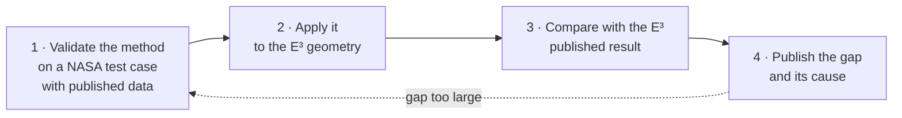
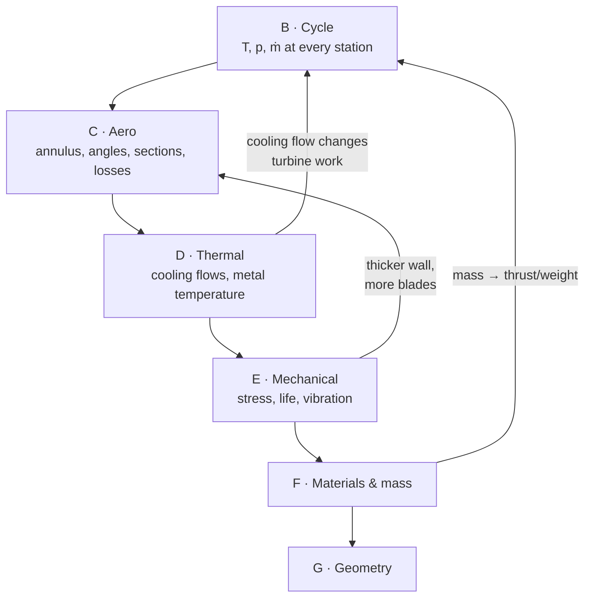

# Work plan — PF-09

**Ten stages, forty-one phases, roughly 510 hours.** A no-compromise rebuild
of the NASA/GE Energy Efficient Engine: every discipline taken to the
fidelity the published data can check, every method validated on a NASA test
case before it is applied, every result compared against what NASA measured.

This replaces the 108-hour plan of 3 September, which produced a checkable
*shape*. This produces a checkable *design*.

> [!important] The one rule that outranks this document
> The twenty-minute weekly job block comes first, every week, without
> exception. This project makes an interview go well. It does not produce
> one. Five hundred hours with zero applications sent is a failure.

---

## What "close to real" means here, precisely

Three levels of fidelity, and the level this plan commits to per discipline.

| Level | Meaning | Example |
|---|---|---|
| **L1 Geometric** | it looks like the component | the reference model in the screenshot |
| **L2 Parametric** | the numbers are right at stage level, from the source | HPC Table X transcribed: 28 blades, r_tip 35.08 cm, stagger 65.2° |
| **L3 Physical** | an analysis with a *validated* method reproduces the published performance to a stated tolerance | mean-line with SP-36 losses gives HPC η_ad within 1 point of Table XIV's 0.860 |

**Commitment:** L3 wherever the E³ publishes a result to check against.
L2 wherever it publishes geometry but no result. Where it publishes neither
(fan blade sections), a stated assumption produced by a validated method.
No discipline is left at L1.

## The validation ladder

No analysis is trusted on the E³ until it has reproduced a published NASA
result on a case built for the purpose. Every method climbs the same four
rungs, in order:

| Method | Rung 1 — validate on | Rung 3 — compare with |
|---|---|---|
| Compressor loss / deviation / DF | NACA TN 3916 65-series cascades | HPC Tables XIV, XV; Table X angles |
| Compressor CFD | NASA Rotor 37 (TP-1337, CFD-validation report) | HPC rotor 1 loss and turning |
| Turbine loss | Ainley–Mathieson R&M 2974 worked cases; SP-290 | HPT Table III, LPT Table I efficiencies |
| Through-flow / radial equilibrium | SP-36 ch. VIII; HPT report Fig. 5 | HPC Table XXI stator vector diagrams |
| Internal cooling correlations | TP-2232 data | HPT report Figs. 27, 33, 35 metal temperatures |
| Blade and disc FEA | CAD-05's converged bracket; HPT report Figs. 61–72 | HPC Table X root stresses; HPT disc LCF |
| Campbell | HPC report Figs. 33–42 (all ten stages published) | same |
| Cycle | closed-form ideal cycle (PF-08 already) | Table XII, three rating points |

## The flaws in the reference model, and where each is designed out

| Flaw in the screenshot | Why it is wrong | Designed out in |
|---|---|---|
| Blades read as untwisted plates | a real blade turns ~30° hub to tip because r·c_θ is held | C2 through-flow, C3 sections from Table XXII |
| LPT flares into a bell | E³ LPT outer wall slopes 25°, not 60°; annulus grows with expansion, not by eye | B4 annulus from the cycle, A3 digitised Fig. 32 |
| No bearings, shafts float | five bearings, two sumps, an intershaft roller — a tenth of the engine's mass | E4, H3 |
| Combustor is a gap | double-annular, 60 cups, 30 nozzles, shingled liner, 48/52 prediffuser | D2, G3 |
| No flanges, no module joints | the engine is built and maintained in modules | H2 |
| Proportions from a photograph | nothing knows what the engine is for | B (all), C1 |
| No clearances | 1 % of span costs 1–2 % efficiency; E³ ran ACC to hold 1.0 / 0.6 % | D4, H4 |
| Single material, no temperature | Ti runs out at 500 °C; the E³ switches to Ni between HPC stages 6 and 7 | F1 |
| Nothing can be checked | every number here has a page, a test, or a stated tolerance | all |

## The discipline loop

Every solver follows the seven steps of [METHOD.md](METHOD.md): tolerance
and validation case first, then parameters → domain → matrix → solve →
plot, then grid independence and the record. A plot without its published
points is not a result.

The stages are not a line. Aero sets the geometry, thermal sets the metal
temperature, mechanical sets the wall thickness, materials set the
allowable, mass feeds back into the cycle through the aircraft — and a
change anywhere re-runs everything downstream. `build.py` is the loop.

---

## Budget

| Stage | What it produces | ATA system | Hours | CAD? |
|---|---|---|---|---|
| **A** Foundation | every source on disk; every table transcribed; topology asserted | 72 · all | 40 | no |
| **B** Thermodynamic design | validated cycle at three ratings, with mixer, secondary air and real gas | 72 · 73 · 75 | 40 | no |
| **C** Aerodynamic design | mean-line, through-flow, sections, CFD — each validated, each compared | 72 | 120 | no |
| **D** Thermal design | HPT cooling reproduced; combustor; secondary-air map; clearance control | 72 (secondary air) · 75 (ACC) · 73 (combustor) | 60 | no |
| **E** Mechanical design | blades, discs, vibration, shafts, bearings, attachments — with FEA | 72 | 90 | no |
| **F** Materials and mass | alloys with allowables at temperature; mass per module | 72 | 20 | no |
| **G** Geometry generation | every part generated from the validated design tables | 72 | 40 | no |
| **H** Hand CAD and assembly | structure, sumps, joints, motion, section | 72 · 79 (sumps) · 71/78 (mixer, nozzle) | 50 | **yes** |
| **I** Whole-engine verification | cross-discipline consistency; `FINDINGS.md` | 72 · 73 · 75 · 76 · 79 | 30 | partly |
| **J** Publication | site, drawings, the write-up | — | 20 | no |
| | | | **510** | 50 in a GUI |

The ATA column names the aircraft-industry system each stage belongs to,
the way manuals, certification paragraphs and job adverts do: **72** the
engine itself — the gas generator (HPC, combustor, HPT: the "core") and
the low-pressure system (fan, booster, LPT) — with its secondary air;
**73** fuel and **76** engine control (FADEC); **75** air, which is where
bleed and active clearance control live; **79** oil and the sumps;
**71/78** nacelle and exhaust; **74** ignition, **80** starting. The E³
reports cover 72, 73, 75 and 76 in depth and 79 through the core report;
the aircraft-side systems (26 fire, 30 anti-ice, 77 indicating) are
outside this project.

At ten hours a week this is a year; at twenty, six months. **Stages A–F need
no CAD licence** and are 370 of the 510 hours. Each stage is a publishable
result in itself; the plan is ordered so that stopping after any stage
leaves a complete piece of work.

---

# STAGE A — Foundation · 40 h

## A1 · Every source on disk · 4 h
- [x] `fetch-sources.sh` — 41 documents across every discipline, all
      public domain or openly published; `--check` lists what is missing
- [x] Run it; 39 of 41 on disk and readable; the two DTIC AGARD files
      still fail on the host (re-run when it is back)
- [x] Record each report's front-matter page offset in `DATA-INDEX.md`

*Closes when:* `./fetch-sources.sh --check` reports zero missing.

## A2 · Transcribe the tables completely · 24 h
The blade-level data is what separates L2 from L1. All of it goes into
`data/`, every value with a page, every table with a consistency test.
- [x] CR-168219 Tables XI–XV, XVIII, XXI, XXIII, XXVI; §4.3, §5.1–5.8
- [x] HPC Table X — per-stage rotor summary, all ten stages
- [x] HPT Tables I–IV; Fig. 3 dimensioned flowpath; Fig. 1 annulus areas
- [x] LPT Table I; bearing arrangement; combustor counts; mixer
- [x] **HPC Table XXII** pp. 154–159 — section geometry for all ten rotors
      **and the IGV and all ten stators**: 252 sections, each with radius,
      chord, camber, stagger, β1*, β2*, tm/c, %c, te/c. Every row checked
      camber = β1*−β2* and cm = in × 2.54; ends checked against Table X;
      stator 10 checked against Table XXI. `data/hpc-blade-sections.yaml`,
      `tests/test_hpc_sections.py`
- [x] **HPC Table XXI** pp. 112–132 — every row's through-flow: 12
      streamlines at inlet and exit, blade-element solidity, DF, loss,
      efficiency, incidence, deviation. 21 rows, 756 station lines. Checked
      five ways (R-BAR vs XXII, U/r = ω = 12,303 rpm, PT/TT chaining along
      the gas path, σ = cN/2πr, DF recomputed). Found: both bleed ports in
      the data where the prose puts them; rotors 9 and 10 re-bladed 88→86
      and 98→94 between original and final; stators 8–9 re-chorded.
      `data/hpc-vector-diagrams.yaml`, `tests/test_hpc_vector_diagrams.py`
- [x] **HPC Figs. 10–20** — every stagewise curve read off and held
      against Table XXI's pitch streamline (solidity, DF, loss, meridional
      Mach, swirl, ΔT, inlet-Mach extremes) and Table X (aspect ratio = the
      tip value). `data/hpc-stagewise.yaml`. Fig. 15 CAFD flowpath is A3.
- [x] **HPC Tables XV–XIX, Figs 55–62** — clearance elements, casing
      temperatures vs test, rig bleeds, clearances, bolting, VSV bushings.
      `data/hpc-mechanical.yaml`
- [x] **HPT report §3 cooling** pp. 17–67 — the T41 margin budget; the
      18.87 % flow budget and its four sums; supply system; stage-1 vane
      (cavity pressures, backflow margins, impingement and film geometry
      row by row, 14-node pitch map, mixing losses per row); stage-1 blade
      (two circuits and six exits both closing on 3.30 %, tip cap, flow
      characteristics, 43-node pitch map in °C and °F, transient); both
      shrouds; stage-2 vane (flows closing two ways, 58 nodes at two spans);
      stage-2 blade (23 nodes, FOD and tip-cap-loss analyses); rotor
      structure and casing thermal fixes; casing 22-node map.
      `data/hpt-cooling.yaml`, `tests/test_hpt_cooling.py`. Five print
      inconsistencies and eight °C/°F read disagreements on the record
- [x] **HPT report §4 ACC** — Table X payoff, Figs 44–47, Tables XI–XIV;
      the same out-of-round method as the LPT. `data/hpt-clearance.yaml`
- [x] **HPT report §5.1–5.2.1 rotor** — lives, materials, methods, rotor
      temperatures and stresses at three times, every disk, shaft and
      retainer with its limiting point. `data/hpt-mechanical.yaml`
- [x] **HPT report §5.2.1.9–5.2.2** — both blades (transient LCF, Campbell,
      dampers, dovetails), rotor dynamics, bolts, casings, both nozzles.
      The stage-1 vane's 3,500-cycle trailing edge at maximum severity is
      the shortest life in the turbine. `data/hpt-mechanical.yaml`
- [x] **HPT report §5.2.3–5.4** — ceramic shrouds, maintainability, FPS
      weight. **CR-167955 fully transcribed** (§1–2 in the published file,
      §3 cooling, §4 clearance, §5 mechanical). Fig. 5 flow angles and energy
      vs span remain a D-status figure for A3.
- [x] **LPT blade counts per stage** — 120 122 122 156 110 (Fig. 52), with
      chords, lengths, aspect ratios; Table VIII takeoff stresses; Table IX
      rupture mission; life and HCF results; stage-1 Campbell; materials;
      design speeds (Table VI 3,539 rpm confirms the cycle derivation).
      `data/lpt-design.yaml`, `tests/test_lpt_design.py`
- [x] **LPT report §2.4–2.8** — Block II flowpath and all ten airfoil
      counts (Fig. 6), Table II vector diagrams, Table III solidity and
      aspect ratios, peak Mach per row, rig results. `data/lpt-aero.yaml`,
      `tests/test_lpt_aero.py`
- [x] **LPT rotor structure and stage-1 nozzle** — Tables X–XVI, Figs 63–77:
      shrouds, dovetails, retainers, disks (every one on its 72,000-cycle
      limit at one location), bolts, stage-1 nozzle. `data/lpt-design.yaml`
- [x] **LPT stator, casing, ACC manifold** — §4.3–4.4.3, Figs 78–89,
      Table XVII. Vane segments multiply to the counts; load per segment is
      six vanes of Fig 81; containment energies imply real blade masses.
- [x] **LPT clearances and weights** — §4.4.4–4.5, Tables XVIII–XXI, Fig 92.
      Out-of-round sums recompute in mils; the combined-clearance bookkeeping
      (round + 0.036 rub, needed = resultant − 0.038) holds; weights add in
      both units and match CR-168219 to 3 %; blade mass by three routes.
      **The LPT report body is fully transcribed.**
- [x] **Fan hardware report CR-165148** — requirements, flowpath, Tables
      I–VI, Appendix A row summaries, airfoil design, fan and booster blade
      mechanical design, rotor structure. `data/fan-design.yaml`. Sec IV
      stator/frame (Tables VII–VIII) and the appendix streamline rows remain.
- [x] **Combustor report CR-168301** — design sections 1–5 in full, the
      development-test section by its summary tables. Fig 8's 24 airflow
      labels sum to 100.0 % Wc; the Mod VI test and the FPS prediction carried.
      `data/combustor-design.yaml`
- [x] HP turbine cooling model CR-165374 — reviewed: it is **Pratt &
      Whitney's** E³ blade-passage flow-visualisation report, not GE's.
      Kept as a design-practice reference; nothing to transcribe for this engine.
- [x] **ICLS CR-168211** — the *tested* numbers against which the FPS design
      is compared: sfc as tested and corrected, thrust, the 2.5 % stack-up,
      component efficiencies, the curves. `data/icls-tested.yaml`. The
      component sections (pp.217–620) are read as each Stage B/I solver
      reaches them.

*Closes when:* every table in `DATA-INDEX.md` marked **L** is marked **T**,
and `tests/test_published_data.py` holds every new table to at least one
independent cross-check.

## A3 · Digitise every flowpath · 8 h

- [x] **LPT airfoil coordinates** — all 30 sections transcribed from the
      appendix page images (the OCR layer was a second route, 30–70 % clean),
      2,879 triples, held by the section checker and by tests against Fig 52
      chords, Table VII radii and gas-path order. `data/lpt-airfoils/`
- [x] Fan and booster — radii from the fan report's Table IV and Fig 15 box
      (`engine-flowpath.yaml`); CR-168219 Fig. 13 carries only blade counts; fan hardware
      report may give dimensions directly
- [x] HPC — `hpc-flowpath.csv` from Table XXI streamlines 1 and 12 (rotor-1
      tip 35.07 vs Table X 35.08); Fig. 15 is the picture of the same numbers
- [ ] Combustor — Fig. 22 and the combustor report's Figs 1/79 are
      undimensioned; liner radii known from the shingle arcs (37.4 / 29.2 cm)
- [x] HPT — dimensioned (HPT Fig. 3) in the published file; its stage-2 exit
      is the LPT's z = 0, and the LPT sections land 6.85 cm downstream against
      the 7.62 cm transition duct with a 21° mean outer wall (max 25°)
- [x] LPT — `lpt-flowpath.csv` from the 30 airfoil sections; Table VII tips
      within 2 %, Fig 52 lengths between the LE and TE heights
- [ ] Transition duct, mixer, nozzle — Figs. 39, 40
- [ ] Whole engine — CR-168219 Fig. 1 is a 4-inch unlabelled cutaway; the two
      stitching offsets (fan axis → HPC IGV, HPC OGV → HPT vane 1) are recorded
      as open in `engine-flowpath.yaml` for Stage H to set from bearing spans
- [ ] State a digitising uncertainty per figure from pixel size and line weight

*Closes when:* one `flowpath.stations` list runs fan face to nozzle with hub
and tip at every row LE/TE, and the HPT segment agrees with the dimensioned
Fig. 3 to within the stated uncertainty.

## A4 · Topology, asserted · 4 h
- [x] Gas path, station convention, crossed spools, power balance, bearings
- [x] `tests/test_topology.py`, `tests/test_published_data.py` — 37 tests
- [ ] Extend: every bleed source and sink; every cavity; every bearing's
      load path to a casing — as data, with tests

*Closes when:* the secondary-air and load-path graphs are data, and no
component, bleed or bearing can be placed inconsistently without a test failing.

---

# STAGE B — Thermodynamic design · 40 h

The cycle is the root of everything downstream; it has to be right at three
rating points, not one, and it has to carry the flows the real engine carries.

## B1 · Mixed-flow cycle · 12 h
- [x] Mixer model — `solvers/e3cycle/cycle.py`: ideal mixing by
      mass-weighted total pressure, effectiveness as the fraction of the
      ideal thrust gain realised (0.838 Table XI), Table XI duct losses
      **on the two streams ahead of the mixing plane** (both rows are
      labelled "duct mixer"; the 1.7 % is not a booster-to-HPC loss)
- [x] Single C-D nozzle with the published coefficient 0.996
- [x] Two fan pressure ratios — bypass and hub streams — as the E³ quotes them
- [x] Real-gas properties — `solvers/e3cycle/gas.py`, Walsh & Fletcher
      polynomials for air and for products at the fuel–air ratio, h and φ
      integrated analytically, four chart points within 0.5 %.
      **Deviation from the plan:** PF-08's `gas.py` is constant-cp inside
      frozen dataclasses; it stays as the closed-form-validated baseline
      and the E³ solver has its own module rather than extending it

*Closes when:* the mixer model reproduces Table XXIII's sfc improvement of
2.9 % for 85 % effectiveness against a separate-flow baseline of the same
core.

*Status 2026-09-06 — open on the level.* 3.6 % at 85 % against a
separate-flow engine without the mixer's 0.57 % loss. Table XXIII's
column-to-column differences (−0.5, +0.3 points across its three
effectiveness/loss pairs) are reproduced to 0.25 point; the level is
0.7 point high because mass-weighted total pressure is the ideal upper
bound. The momentum-balance mixing plane that brings it down needs the
mixing-plane area (Figs 39–40, undimensioned) — Stage H. Pinned as a
strict xfail in `tests/test_e3cycle.py`; STEP0 finding 3.

## B2 · Secondary air in the cycle · 8 h
- [x] Every Table XI stream at its published fraction, source and sink:
      CPD nonchargeable mixed in at T3 ahead of the rotor, the fuel–air
      ratio solved so that Table XII's T41 is met after it; CPD chargeable
      and stage 7 rejoin at HPT exit and do LPT work; stage 5 at LPT exit.
      Bleed-port temperatures from Table XXI's stator-5 and stator-7 exit
      total pressures (0.305 and 0.506 of HPC exit)
- [x] Chargeable vs nonchargeable handled in turbine work
- [x] Zero customer bleed and power extraction, 100 % ram, no shaft loss
      (none listed in Table XI) — as the report

*Closes when:* turbine work per spool changes by the amount the cooling
bookkeeping predicts, and the HPT work split still lands at 56.5 % stage 1.

*Status 2026-09-06.* The spool balance is in the solver (HPT pressure
ratio 5.0 at all three ratings, LPT 4.1–4.6). The 56.5 % stage split is a
mean-line quantity and is carried to C1.

## B3 · Three rating points · 12 h
- [x] Max climb (the match point), max cruise, sea-level takeoff at the
      flat-rating temperatures of §4.4 p.33: +10, +10, +15 °C
- [ ] Component maps or scalings so off-design points follow from the
      match point — **deferred to Stage C**; each point is solved with
      Table XII's own ratios and T41 as inputs, the sfc the output
- [x] Table XII at all three points; takeoff sized to its published
      173.5 kN, which puts the fan at 580 kg/s corrected (0.90 of the
      match point) — a derived number for the Stage C fan map to check

*Closes when:* sfc, OPR, BPR, both FPRs, HPC PR and T41 agree with Table XII
at all three points to a tolerance stated **before** the run — and the
tolerance is the same at all three. A model tuned to one point and off at
the others has been tuned, not validated.

*Status 2026-09-06 — two of three inside the band.* sfc +0.46 / +0.56 /
+1.91 % against ±1.5 % stated first in `solvers/e3cycle/STEP0.md`;
takeoff is a strict xfail with its size pinned. **Finding:** Table XII is
a mixed-day table — T41 on the flat-rating day (footnote 2), sfc on the
standard day (header, §4.4). On the flat-rating day the core reaches the
mixing plane at 0.95–0.96 of the bypass pressure at all three ratings; on
the standard day 1.15–1.18, which no mixer can run. The residual has the
sign and ordering of the constant-thrust day effect and needs the maps.
Second finding: fan hub PR × HPC PR exceeds the printed OPR by 1.4–2.3 %
— a booster-to-HPC transition loss the report never lists; the solver
takes it from the OPR and records it (2.22 / 1.84 / 1.41 %).

## B4 · Station properties and the annulus · 8 h
- [x] T, p, ṁ at every cycle station; ρ, c_x, Mach at every station a
      report gives a design Mach for — `solvers/e3cycle/stations.py`
- [x] Annulus area by continuity at the axial Mach each row was designed
      to (HPC Fig 12 meridional Mach; HPT Table III exit Mach; LPT Table II
      and Fig 7), real-gas static properties
- [x] Computed hub/tip against the tables' hub/tip — **the meridional
      plot**, `solvers/e3cycle/figures/annulus.png`, with the pass band
      drawn on every check station

*Closes when:* the computed annulus lies inside the digitising uncertainty
of NASA's at every station where NASA's is dimensioned (HPT), and the
disagreement elsewhere is quantified and explained.

*Status 2026-09-06 — closed.* HPT stage-1 and stage-2 exits −3.6 % and
+0.2 % against Fig 3 at Table III's exit Mach numbers. The turbine
cycle-match tables close by two routes each: HPT W41√T/P +0.8 % and
Δh/T +0.7 % (Table XVIII), T49 +0.25 %, LPT W49√T/P −0.5 % and Δh/T
+2.8 % (Table XXI); the fan-face specific flow +0.3 %. **Three findings**
(STEP0 B4): the HPC geometric annulus reads 5.5 / 10.2 % short at inlet /
exit and closes to 2.5 / 0.2 % with Table XXI's own blockage 0.97 / 0.90;
Fig 7's vane-1 LE Mach 0.40 is 18 % off the sections and the cycle, which
put it at 0.32; Table II's hub/tip Mach columns cannot be equal-weighted
(6–17 % over), and at the pitch Mach all five LPT stage exits sit a
uniform 3.4–5.5 % under the sections' annulus — a through-flow blockage of
4–5 % the LPT report applies and does not print. Strict xfails pin each.

**Stage B closes** with two items carried: the mixer level to Stage H
(B1), the constant-thrust day effect at takeoff to Stage C (B3).

---

# STAGE C — Aerodynamic design · 120 h

Four fidelity rungs per component: mean-line, through-flow, sections, CFD.
Each validated before applied. Each compared with the E³ published result.

## C1 · Mean-line with loss models · 32 h

Built to [METHOD.md](METHOD.md); step 0 named in the table there.
- [x] **Compressor deviation** per SP-36 eq (270) and Fig 160 (Carter) —
      `solvers/meanline/compressor.py`, **unit 4**. Validated not on TN
      3916 but on something better: the **240 deviation angles Table XXI
      prints**, one per streamline per row, at the E³'s own cambers and
      solidities. Mean bias −0.39°, rms 2.58°. The rule has almost no
      bias and a clear structural error: rear rotors under-predicted by
      1.4–2.9° rising with stage, front stators over-predicted by
      1.5–2.3°, front rotors within ±0.9° (finding 11)
- [x] **Compressor loss** — **unit 4b closes the HPC by two routes.**
      Route 1: real-gas adiabatic efficiency from the printed pressure and
      temperature ratios reproduces Table XXI's own cumulative-efficiency
      column at every streamline to better than 0.01, and area-weights to
      **0.8455 against the 0.847 design intent**. Route 2: the printed
      element loss coefficients alone, compounded through 21 rows with
      rothalpy across every rotor, rebuild the printed pressure ratio to
      **+0.03 % in the mean** (rms 0.72 %) and the printed temperature
      ratio independently. SP-36 Fig 148 was not needed and is not
      digitised: for this engine the printed element losses are the better
      source, and they are now shown self-consistent. Efficiency runs
      0.778 at the hub, 0.869 at mid-span, 0.811 at the tip — the end
      walls pay in work, not in pressure (findings 14–17)
- [x] **Turbine loss** per Ainley–Mathieson R&M 2974 (profile, secondary,
      tip clearance, trailing edge) — `solvers/meanline/losses.py` from
      `data/methods/ainley-mathieson-rm2974.yaml` (Figs 4–9 digitised,
      equations 1, 4, 5, 6, the report's stage calculation). **Validated
      on the report's own worked example**: every row coefficient within
      its chart-read band, the stage characteristic within 0.010 in
      pressure ratio and 0.3 point in efficiency at four flows, choking
      flow within 0.1 %. **Applied to the E³ LPT** it reads 0.837 (0.869
      with the Dunham–Came aspect-ratio term, an assumption until the
      paper is on disk) against 0.917: a 1951 correlation with no height
      term and 1951 profile losses, the reasons named in STEP0 unit 2.
      Strict xfails pin both
- [x] Turbine loss cross-check per SP-290 vol. 2 — **unit 2b closes the
      LPT**. Chapter 7's end-wall method (eq 7-45 to 7-47) computes the
      end-wall loss from area, 1 + (s/h)·cos(stagger), instead of
      correlating it; with the profile loss still R&M 2974's and the
      Reynolds rule of its §8 applied, the five-stage efficiency is
      **0.911 against 0.917** (status 0.915, rig 0.920), inside both the
      ±2 points the method claims and its own ±15 % loss band. Expansion
      ratio 4.68 against the cycle's 4.55. Kacker–Okapuu 1982 is not
      needed for this result and is left to fetch before the HPT, whose
      shorter rows put more of the loss in the profile term
- [ ] Stage-by-stage HPC: work split, DF per row, de Haller, stall margin
      estimate, VSV schedule effect. Compare stagewise with HPC report
      Figs. 14, 17, 18, 27
- [x] Fan and quarter-stage — **unit 6**. The fan's specific flow
      (208.9 kg/s·m²) and corrected tip speed (411.5 m/s) give an axial
      Mach of 0.630 and a **tip relative Mach of 1.405 against the printed
      1.41** — two numbers that never mention Mach reproducing a third
      read off a blade-section plot. The inner sections reach their bands
      only just and lean opposite ways (shroud −0.064, hub +0.063), which
      is the fan's radial equilibrium and not scatter (finding 22). Both
      tip speeds imply the printed 3727.7 corrected rpm to half an rpm;
      the island split closes to 0.00 and −0.02 kg/s at 22.3 % under and
      42.7 % returned, giving a bypass ratio of 6.813 against 6.8; every
      CAFD row efficiency recomputes to 0.002 but the inner OGV. The
      booster carries ψ = 0.25 against the fan's 0.67 — a quarter-stage
      in loading as well as in name
- [x] HPT: two stages at 56.5 / 43.5 % work — `solvers/meanline/hpt.py`,
      **unit 3**. η_tt 0.921 against Table V's 0.9155, the warm-air rig's
      0.925 and Table XI's 0.927, all inside the method's ±2 points;
      loading, stage-exit Mach, vane and blade exit Mach and stage-1
      reaction and turning all in band. **HPT report Table V newly
      transcribed** — an efficiency audit whose seven corrections sum to
      its printed net exactly — and its one line with a stated baseline,
      the −1.50-point tip-clearance debit, is priced by the model at
      −0.95: R&M 2974's B·(k/h) is light for an unshrouded HP rotor
      (finding 9). The stage-1 exit-swirl sign, printed only as a
      magnitude, is settled *against* rotation by the reaction column
      (finding 7). Cooled-turbine efficiency: Table V prices cooling as a
      **+0.30 credit**, the nonchargeable flow rejoining upstream of the
      vane-1 throat and working
- [x] LPT: five stages, loading and flow coefficient per stage — **units
      1, 2 and 2b**. Loading on four of five stages within 0.04 of Table
      II; efficiency 0.911 against 0.917. The stage-4 acoustic gap is
      geometry, recorded in `lpt-design.yaml` and checked in
      `tests/test_lpt_design.py` — **kinematics done** (`solvers/meanline/lpt.py`,
      unit 1 of `solvers/meanline/STEP0.md`): from the cycle state, Δh and
      α₂ per stage and the sections' pitch radii, 28 of 50 Table II pitch
      quantities inside their bands, loading on four of five stages; the
      22 misses are four systematic findings (station plane; Table II's φ
      and reaction columns not its own angles' kinematics; its stage PRs
      are the pre-rematch cycle's, product 4.21 vs 4.55; β₂ 3–7° low,
      carried to C2). Loss model and efficiency are unit 2
- [x] **Derive the stage counts** from loading limits — **unit 7**, and
      **C1 closes**. From Stage B's work, the two shaft speeds and the
      flowpath radii only, with generic limits from the agent's §4 (never
      E³ values): **HPC 10, HPT 2, booster 1 — exact**. The derivation
      also rejects the single-stage HPT (ψ 1.38 against 0.85) that the
      HPT report's own Table II evaluated and rejected. Two misses, both
      informative: the fan needs 1 where ψ ≤ 0.45 asks for 2, because a
      transonic fan is bounded by tip Mach and stress, not diffusion
      (finding 28); the LPT uses 5 where loading asks for 4, because an
      LPT's stage count is set by efficiency, not feasibility — the fifth
      stage is where the sfc goal was won (finding 29)

*Closes when:* HPC η_ad within **1.0 point** of 0.860 (Table XIV); fan
bypass and hub η within 1.0 point of Table XIII; HPT η within 0.5 point of
92.4 %; LPT within 0.5 point of 91.7 % (LPT Table I). Tolerances are the
scatter of the loss correlations, not a fit.

*Status 2026-09-06 — closed, with the turbine tolerances met at the
methods' own accuracy rather than the 0.5 point the plan asked for.*
Seven units, `solvers/meanline/` with `STEP0.md` stating every band
before its run:

| Unit | | Result |
|---|---|---|
| 1 | LPT kinematics | 28 of 50 Table II pitch quantities in band |
| 2 | Ainley–Mathieson | reproduces R&M 2974's worked example; E³ LPT 8 points low |
| 2b | SP-290 end-wall | **LPT 0.911 vs 0.917** |
| 3 | HPT | **0.921 vs 0.9155 / 0.925 / 0.927**; Table V transcribed |
| 4 | compressor deviation | Carter vs 240 printed points: bias −0.39°, rms 2.58° |
| 4b | compressor loss | **HPC 0.8455 vs 0.847**, two routes agreeing to 0.03 % |
| 5 | HPC stagewise | Figs 11, 17, 18 to ≤0.03/0.0008/0.004; Fig 14 is the span average |
| 6 | fan | tip M_rel **1.405 vs 1.41** from the specific flow and tip speed |
| 7 | stage counts | HPC 10, HPT 2, booster 1 exact from the cycle alone |

**The 0.5-point turbine tolerance was not met and could not be**: the
loss methods themselves claim ±2 points (R&M 2974 §9). Closing to
0.5 point is a C4 (CFD) claim, not a mean-line one, and the plan is
corrected here rather than the result being overstated.

## C2 · Through-flow · 24 h

Built to [METHOD.md](METHOD.md); step 0 named in the table there.
- [x] Radial equilibrium (simple, then with streamline curvature) —
      **unit 8**, `solvers/throughflow/`. Audited against the through-flow
      that already exists rather than solved first: Table XXI's 12
      streamlines at 42 stations satisfy simple radial equilibrium to
      0.243 of the largest term, and restoring the streamline-curvature
      term the simple form discards cuts that to **0.172, better on 36 of
      40 stations**. The φ column is confirmed to be real geometry,
      reproducing atan(dr/dz) from the table's own coordinates to
      **0.23°** (finding 31). Two errors of mine caught by the data and
      recorded: differencing enthalpy and entropy separately doubles the
      apparent residual (the equation cancels 10:1 — finding 32), and the
      curvature term's sign, which geometry and a redone derivation
      settle rather than a fit
- [x] Reproduce the **radial distributions** in HPC Table XXI — **unit 9**,
      `solvers/throughflow/predict.py`. Given the three things a designer
      specifies — the vortex law r·c_θ(r), the spanwise work and the
      spanwise loss — radial equilibrium is integrated outward from the
      hub for c_z, continuity sets its level, and the Mach and flow angle
      are outputs. At the **stator-10 exit, the station this plan named:
      swirl rms 0.02° against ±2°, Mach rms 0.002 against ±0.02** — the
      criterion met with two orders of magnitude to spare. All 42
      stations are predicted; the rear half lands inside 0.2° and the
      transonic front does not (5.2° at the rotor-1 exit), which is a map
      of where a high-OPR compressor is hard (finding 35)
- [x] Reproduce HPT report Fig. 5 — **unit 11**, and **C2 closes**.
      Fig 5c extracted from the 300 dpi scan by `tools/read_hpt_fig5.py`
      (numerically, not by eye — the page carries NASA's own poor-quality
      stamp) into `data/hpt-fig5.yaml`. Area-weighted against the HPT
      report's **own** design point, Table I at T41 1557 K rather than the
      final cycle's 1517: **stage 1 +0.4 %**, stage 2 +4.5 %, total
      +2.2 %, and the 56.5 / 43.5 work split recovered as 0.555 from the
      figure alone. **Not free vortex** (which would be uniform; this
      varies 12–13 %) and **not solid body** either (which would rise
      monotonically; this peaks at 50–55 % and unloads both end walls) —
      "forced-vortex distribution" here means a tailored one. And Fig 5's
      angle and Mach panels could never have settled it: at a hub/tip
      ratio of 0.88 a free vortex swings a 70° exit angle by 2.2° across
      the whole span (findings 39–41)
- [x] LPT vector diagrams per LPT report §2.6 — **unit 10**,
      `solvers/throughflow/lpt_vortex.py`. The report calls the design
      "controlled vortex" and never says what that is; fitting
      c_θ ∝ r^n to Table II's hub/pitch/tip columns gives **n = −0.31 to
      −0.69, mean −0.51 — half a free vortex** (which would be −1.00),
      with angular momentum varying 17–22 % across the span. The
      exponent drifts toward free vortex rearward as the radius ratio
      opens from 0.76 to 0.61: it is scheduled, not constant (finding
      37). The same fit on the HPC's nine swirling stators gives +0.54 to
      −0.76 with no order — a compressor stator's swirl is a schedule for
      stall margin and rotor-inlet Mach, not a vortex law (finding 38)

*Closes when:* the through-flow reproduces Table XXI's stator-10 exit
swirl and Mach distributions within 2° and 0.02 across the span, and the
HPT energy-extraction profile shape of Fig. 5.

*Status 2026-09-06 — closed.* `solvers/throughflow/`, its own `STEP0.md`.

| Unit | | Result |
|---|---|---|
| 8 | radial-equilibrium audit of Table XXI | 0.243 of the largest term; 0.172 with curvature restored, better on 36 of 40 stations |
| 9 | predict the spanwise distributions | **stator-10 exit: 0.02° swirl, 0.002 Mach** against ±2° / ±0.02 |
| 10 | the vortex law | LPT "controlled vortex" is **n ≈ −0.5**; the HPC has no single law |
| 11 | HPT Fig 5c | stage-1 work **+0.4 %**; neither free vortex nor solid body |

The swirl criterion is met with two orders of magnitude to spare, and the
Fig 5 profile shape is reproduced and explained. Twelve findings, 30–41.

## C3 · Blade sections · 32 h
- [x] **Reconstruct every HPC section** from Table XXII — **unit 12**,
      `solvers/blading/`. Camber line a double circular arc with the join
      solved so each section reproduces β₁*, β₂* **and** the printed
      stagger, which makes the join position an output: **stators come out
      as circular arcs (median max camber 49 % of chord), rotors
      aft-loaded (55 %)** (finding 43). Thickness by the quarter-sine
      distribution CR-165148 §II.A documents for this engine. Stacking on
      the stacking axis with pretwist and tilt is still to do
- [ ] HPC stators from Table XXI section data; vane counts
- [x] HPT vanes and blades — **unit 14**, and Fig 6 was **not needed**.
      Table IV's aspect ratio *is* height over throat, and Fig 3 gives the
      annulus heights, so the throat follows from two printed numbers:
      o/s 0.257–0.488, and through R&M 2974's Fig 5 outlet angles within
      **1.8° rms** of unit 3's mean-line, which was built from the cycle
      and the work split and shares no input with this. Zweifel from the
      printed solidity and the mean-line angles matches Table IV on
      **three of four rows to 0.03**; the stage-2 vane is 0.15 low — the
      same row unit 3 flagged (findings 49–51). Digitising Fig 6 remains
      only if the actual shapes are wanted for Stage G
- [x] LPT sections — **unit 13**, and better than digitising the figures:
      the appendix *coordinates* were transcribed in A3, so two published
      relations can be tested against them directly.
      **R&M 2974's outlet-angle rule, applied to the throat computed from
      the E³'s own coordinates, reproduces Table II's printed exit angles
      to 1.4° rms** (mean −0.71° from Fig 5 alone, +0.27° once equation
      (1)'s −4(s/e) term is added with *e* fitted to the suction surface
      between throat and trailing edge). **Zweifel** from the coordinates
      and Table II's angles reproduces Table III to 0.083 rms at pitch
      (findings 46–48). Digitising Figs 9–18 for the surface Mach
      distribution remains, and is C4 work
- [x] **Fan blade — not published. Designed** — **unit 15**,
      `solvers/blading/fan_blade.py`, and labelled a design everywhere it
      is recorded. Velocity triangles from Fig 3's radial pressure profile
      and the two published Mach numbers; chord, thickness, count and the
      5° incidence printed; camber closed with Carter's deviation and the
      aft-loaded camber line unit 12 inferred for this engine's rotors.
      **Checked against the one published number not used to build it —
      the throat margin: 11–17 % designed against a stated 5–8.8 %**, so
      the design is conservative (finding 53). Camber falls 35° → 1°,
      turning rises 13° → 54°, deviation 6.6° → 0.3°, tip solidity 1.43
      against a printed 1.40, all monotonic (finding 52). AGARD LS-167 is
      one of the two sources DTIC still will not serve, so SP-36's Carter
      rule was used instead. Scope: Fig 3 publishes the profile only from
      the OD to the island at 78 % of the flow, so the inner span is left
      to the booster rather than extrapolated
- [ ] Booster rows and inner OGV with the published sweep 60° / lean 0–20°
- [x] Throat area per row from the sections — **unit 12**. Nothing about
      the throat is transcribed; it comes out of seven printed numbers per
      section. **The transonic rotors 1–4 land at 4.0 % above choking
      against the report's stated 6 %**, and the margin rises monotonically
      2.2 % at rotor 1 → 6.2 % at rotor 4 → 28.0 % at rotor 10, so the
      constraint binds only where the flow is transonic — which is the
      arithmetic of why a compressor's throat is a front-stage problem
      (finding 42)

*Closes when:* every row's section set reproduces the published chord,
camber, stagger and thickness within transcription precision, and every
throat passes its flow.

## C4 · CFD, selectively · 32 h
Not every row. The rows where a loss correlation is least trustworthy, and
only after the method is validated.
- [~] **Validate OpenFOAM on NASA Rotor 37** — **the case is written, the
      solver is not installed.** `data/methods/rotor37-validation-case.yaml`
      holds the design point (PR 2.106, TR 1.270, η 0.877, 20.188 kg/s at
      17,188.7 rpm, 36 blades, hub/tip 0.70), the measured 100 % speed line
      with its choking flow of 20.93 kg/s, the published Glenn-HT result to
      compare against, and **the pass bands, stated before any solver
      exists**: 1 % on choking flow, 0.02 on pressure ratio at the
      peak-efficiency point, 1.5 points of efficiency, 3° of spanwise exit
      angle, GCI 3 %. `tests/test_rotor37_case.py` proves the case is
      internally consistent — the printed efficiencies follow from the
      printed ratios, and four scan-corrupted values are recorded null and
      recomputed rather than transcribed.
      **GATE: no CFD solver is installed** — no OpenFOAM, no SU2, no
      Homebrew formula, and Docker's daemon is stopped. Installing a
      multi-gigabyte image is the user's decision, not this project's
- [ ] HPC rotor 1 (transonic, 28 blades): loss, turning, shock position
      vs the mean-line and Table X/XXII
- [ ] HPT stage-1 vane: exit angle and Mach vs Table III / Fig. 5
- [ ] One LPT stage, for the high-aspect-ratio secondary-flow loss
- [ ] Feed the CFD losses back into C1 and re-close

*Closes when:* Rotor 37 pressure ratio and efficiency at design flow land
within the published experimental scatter, and the E³ row results move the
mean-line prediction *toward* the published efficiency, not away.

*Status 2026-09-06 — gated, not skipped.* The validation case and its
bands are written and tested; every E³ row item below waits on a solver.
Worth noting for when one arrives: the published Glenn-HT reference used
**one grid resolution only**, by its own statement, so it supplies a
comparison but not a converged result and cannot stand in for METHOD.md's
step 6.

---

# STAGE D — Thermal design · 60 h

## D1 · HPT cooling, reproduced · 24 h
- [ ] Flow network per row from the HPT report §3 and the E³ cooling model
      report: supply pressure, orifice, internal passages, film rows, tip
      cap, TE slots — with the published cooling flow fractions
- [ ] Internal heat transfer from TP-2232 correlations (validated against
      the data in that report), external from the report's own
      coefficients (§5.4.4: below CF6-based values, especially pressure side)
- [ ] Film effectiveness by row; superposition
- [x] Metal temperature distribution — **units D1 and D2**. Unit D1 started it from the
      other end. Before any network, the overall cooling effectiveness
      φ = (T_gas − T_metal)/(T_gas − T_coolant) follows from four printed
      numbers per row, and **all four cooled rows collapse onto
      φ/(1−φ) = 0.421·Wc^0.916, R² = 0.98** across an eightfold range of
      coolant flow — with an exponent Dittus–Boelter predicts at 0.8
      (finding 58). The metal temperature is held to 26 °C (947/953/928/929)
      while the gas falls 1739 → 1038 °C: the metal is the constant and
      coolant is bought to hold it (finding 59). **Unit D2 then met the
      closure at two points of three**: Fig 23's external heat-transfer
      coefficient and one fitted internal conductance (5,476 W/m²·°C, the
      slope of a line through the origin) put the suction surface at −3 K
      and the midchord at −8 K of Fig 27, against a ±25 K band. The
      leading edge misses by +31 K, and the deficit corresponds to a film
      effectiveness of **0.064 there and ≈0 at the other two** — which is
      exactly where the blade's three rows of showerhead holes are
      (findings 61–63). The flow network, film superposition and the
      transient remain
- [ ] TBC effect on the dome and shingles (combustor) and on the HPT
- [ ] Transient: Fig. 28 — the thermal gradients that drive LCF

*Closes when:* pitch-section metal temperature within **25 K** of the
published distribution at three chordwise points, with the published
cooling flow, not a tuned one.

## D2 · Combustor · 12 h
- [ ] Liner cooling: impingement + effusion per shingle row, from the
      combustor report; wall temperatures — **and the pressure drop from
      geometry, which unit D5 did NOT attempt**: it needs the liner hole
      areas and discharge coefficients, and Stage A transcribed the
      airflow split but not the hole geometry (it is in drawings). The
      5.0 % is a maximum requirement and the cycle uses exactly 5.0 %, so
      nothing downstream is blocked
- [x] Exit temperature profile and pattern factor — **unit D5**,
      `solvers/thermal/combustor.py`. **T41 is the rotor inlet, not the
      combustor exit**: used as the exit average it gives a pattern factor
      of 0.386 against a 0.25 requirement. Solving the noted 0.26 instead
      gives a combustor exit of 1503 °C, **82 °C above T41 — which is
      exactly what the nonchargeable coolant does**, and agrees with what
      Stage B's cycle solver computed independently from the other end
      (55 K at max climb on 7.46 % W25 against 9.46 % here at a hotter
      condition). Fig 5's profile peaks at 65 % height, where the HPT
      blade's rupture-limiting section sits, and the pattern-factor limit
      is policed only between 20 and 90 % (findings 70–72). Fig 8's 24
      airflow labels sum to exactly 100.0 % — 40.6 % through the domes,
      59.4 % on liner cooling and dilution
- [ ] Loading, residence time, primary-zone equivalence ratio at the three
      rating points; pilot-only vs both domes
- [ ] Emissions estimate against Tables XVI–XVII, method from AGARD CP-422

*Closes when:* pressure drop 5.0 % reproduced from the geometry, and the
exit profile is what D1 used.

## D3 · The secondary-air map · 16 h
- [x] Every bleed, cavity, seal and sink as a network — **unit D3**,
      `solvers/thermal/secondary_air.py`. The eight detailed-design items
      sum to exactly the printed 18.87 % of W25 and the four final streams
      to **16.14 % against this plan's 16.1 target**; the 2.7-point
      difference is the recorded consequence of core testing finding lower
      heat-transfer coefficients. Each stream's source and the report's own
      reason for it are recorded (finding 66)
- [~] Rim seals: purge vs ingestion margin — **the stage-1 nozzle's two
      cavities are done** (unit D3): both keep hot gas out on either
      definition, and the printed backflow margin was recomputed from the
      printed pressures. **The printed definition names the gas *total*
      pressure but only the forward cavity reproduces that way**; the aft
      cavity's 1.0 % comes out exactly against the gas *static*, and is
      0.32 % against the total — the thinnest seal in the turbine
      (finding 65). The remaining disc cavities are still to do
- [ ] Labyrinth seal leakages from clearance and pressure ratio
      (sealing report); sump pressurisation (§5.7)
- [ ] **Thrust balance** on each rotor across the mission; balance-piston
      cavities per HPT report Figs. 95–96; net load into bearings 1 and 3
- [ ] Rotor bore cooling with fan discharge air (§5.2.2)

*Closes when:* total secondary air lands at Table XI's 16.1 % of W25 and
every cavity has a pressure that keeps hot gas out.

## D4 · Clearance control · 8 h
- [ ] Casing and rotor thermal growth vs time through takeoff–climb–cruise
- [ ] ACC: fan-air impingement effect on HPT/LPT casing; the CPD warm-up
      circuit
- [x] Reproduce HPT report Figs. 44–47 — **unit D4**,
      `solvers/thermal/clearance.py`. **The cruise clearance closes by two
      independent routes from two chapters in two units**: Table III's
      1.0 % and 0.6 % of span become 0.0427 and 0.0419 cm against §4's
      desired 0.041 — differences of **0.040 % and 0.013 % of span
      against this plan's 0.2 % band**. Table X's whole ACC payoff
      recomputes line by line to 0.006 point and 0.002 on the total
      (1.535 vs 1.533), with the sfc closing exactly at −1.24 + 0.02 =
      −1.22 %. The transient has the published shape (findings 67–69)

*Closes when:* the clearance transient has the published shape and the
cruise values land within 0.2 % of span.

*Status 2026-09-06 — closed.* Both halves met; the cruise values land
within 0.04 % of span, five times inside the band.

---

# STAGE E — Mechanical design · 90 h

## E1 · Blades · 24 h
- [x] Centrifugal stress per row — **unit E1**,
      `solvers/mechanical/blade_stress.py`, and **E1's closure is met**:
      all ten stages within **6.5 %** against a 10 % band, from the
      section geometry alone (Table XXII's chord and t/c at twelve
      sections, the root and tip radii, one speed, one density — the
      airfoil shape constant cancels because only A(r)/A_root enters).
      **The material crossover falls out of the data at stages 4/5** —
      titanium forward, nickel aft, and neither works for the other group
      — which is exactly where CR-168219 says the rotor is inertia-welded
      (finding 74). Table X's stresses are at the **deteriorated-engine
      13,948 rpm**, not the 12,303 aero design point; using the latter
      reads every stage 22 % low (finding 75)
- [ ] Gas bending from the C1 loads; tilt to cancel; compare Table X
      `max_root_stress`
- [ ] **FEA in CalculiX** on HPC rotor 1, HPT blade 1, LPT blade 1: mesh
      convergence as CAD-05 did it; peaks on constraints disbelieved
- [ ] HPT blade creep: Larson–Miller with the D1 metal temperatures;
      rupture life vs the report's BUCKET-CREEP result (Figs. 75–76, 83–84)
- [ ] HPT blade LCF from the D1 transient (Fig. 78)

*Closes when:* Table X centrifugal stresses reproduced within **10 %** all
ten stages, and HPT stage-1 rupture life within a factor of 2 of the
published — that is the scatter of creep data.

## E2 · Discs · 20 h

Built to [METHOD.md](METHOD.md); step 0 named in the table there.
- [ ] Disc profiles from the cross-sections (A3) for every rotor stage —
      **this is what gates the rest of E2** (finding 81)
- [x] Rim load and bore stress — **unit E2**, `solvers/mechanical/disc.py`.
      **The bore doubling for a small hole is demonstrated exactly**
      (2.0000 in the limit, 2.0043 at a/b = 0.10) — E2's stated closure
      half, met (finding 77). Rim load 76 × 77.395 kN = **5,882 kN, 600
      tonnes** on one disc (finding 80). The published bores, 779–910 MPa,
      lie inside the constant-thickness bracket 691 < σ < 1388 MPa
- [ ] Burst margin on average tangential stress at 120 % speed
      (33.27 / CS-E 840) — **gated on the profile**
- [ ] **FEA** on HPT stage-1 disc; compare with HPT report Figs. 61–64;
      interstage seal disc Fig. 65 — **gated on the profile**
- [ ] LCF at bore and slot (Fig. 61 gives concentration and life)
- [ ] The bolted-joint and inertia-weld rotor structure of the HPC

*Closes when:* HPT disc peak effective stress within 10 % of Fig. 64, and
the bore doubling for a small hole is demonstrated on the model.
**Half closed 2026-09-07**: the bore doubling is exact; the Fig. 64 half is
gated on transcribing the disc cross-sections, and that is recorded as a
finding rather than skipped. Unit E2 also rejected the assumption behind
the whole stage: **not one of nineteen published rotor stresses scales as
N²** — the E³ HPT rotor is a thermal structure at its limiting times, with
bores peaking at 875 s and gas-washed parts at 40 s (finding 78), and
three printed numbers cannot separate the two loads (finding 79).

## E3 · Vibration · 20 h

Built to [METHOD.md](METHOD.md); step 0 named in the table there.
- [x] **The beam, validated first** — **unit E3**,
      `solvers/mechanical/beam.py`: Euler–Bernoulli FE with Green's-theorem
      section properties and centrifugal geometric stiffness. Reproduces
      the clamped-free, clamped-pinned and clamped-clamped eigenvalues to
      **0.0001 %**, and the uniform-cantilever Southwell coefficient
      **1.193** (growing as 1.193 + (π/2)·R/L)
- [x] Blade modal analysis on the four blades whose Campbell diagrams *are*
      transcribed — `solvers/mechanical/blade_frequency.py`. **The booster
      rotor closes at −2.7 %** against a published 250 Hz, from built
      sections and a handbook modulus, nothing fitted (finding 82). Each
      blade needed the tip condition its own report names, and the fan's
      80 Hz falls inside the free-cantilever bracket and *below* the
      shroud-pinned one — right for the lowest in-phase mode (finding 83).
      **The stage-9 and stage-10 HPC vanes both bracket correctly and agree
      on the same 0.62–0.66 restraint fraction** (finding 87)
- [ ] **Campbell diagrams vs HPC report Figs. 33–42** — ten published
      diagrams to match, with the stage-3 root-thickening for 4/rev as the
      test. **GATED**: `hpc-mechanical.yaml` records Figs 33–54 as
      "remain figure-status (A3)". The ten predictions are made and
      recorded (finding 88) so the gate is a comparison, not a rebuild
- [ ] Vane Campbell vs Figs. 46–56
- [ ] LPT stage 1 coupled blade–disc (LPT report Fig. 63); tip-shroud and
      angel-wing effects
- [ ] Flutter screen: reduced frequency per row; flexural and torsional
      stability plots vs HPC Figs. 43–44
- [ ] HCF margin by Goodman on top of the E1 mean stress

*Closes when:* first three modes of every HPC stage within **5 %** of the
published Campbell lines. **Gated 2026-09-07** on transcribing HPC Figs
33–42; recorded as finding 88 rather than skipped. What could be tested
was: the booster closes at −2.7 %, the fan and both HPC vanes bracket
correctly, and two misses are recorded rather than tuned — the pinned-tip
LPT blade reads 45 % high with the rigid clamp named as the cause
(finding 84), and centrifugal stiffening is under-predicted by 30–41 % on
both free blades (finding 85). A pinned-tip blade's frequencies *fall*
with speed, which no tension model can produce (finding 86).

## E4 · Shafts, bearings, rotordynamics · 16 h
- [ ] LP and HP shaft torsion and bending; the LP shaft through the HP
      spool with clearance
- [ ] Bearing loads: radial from mass and unbalance, axial from D3 thrust
      balance; check against bearing type (ball 1, 3; roller 2, 4, 5)
- [ ] Critical speeds of each rotor with bearing stiffness; squeeze-film
      damper effect (CR-168219 §5.11, Figs. 56–57)
- [ ] Blade-out unbalance load into mounts (§5.9.2; 33.94 / CS-E 810)

*Closes when:* no rotor critical inside the operating band without a
damper, and thrust-bearing load stays inside capacity in both directions.

## E5 · Attachments and joints · 10 h
- [ ] HPC dovetails per HPC report §3.2.3: neck tensile, tang shear, crush;
      weak-link order disc > blade > airfoil
- [ ] HPT and LPT dovetail / fir-tree; boltless retainers (HPT Fig. 66)
- [ ] Casing flange bolting per HPC Table XVII; rotor bolt relaxation
      (HPT Figs. 89–91)

*Closes when:* every attachment has margin on all three stresses and the
weak-link order holds.

---

# STAGE F — Materials and mass · 20 h

## F1 · Materials with allowables · 12 h
- [ ] Alloy per component from the reports (HPC Table X; HPT Figs. 51–52;
      combustor §5.3; fan §5.1.2; LPT Fig. 50)
- [ ] Properties at temperature from **MIL-HDBK-5J**: Ti-6-4, Ti-8-1-1,
      Inconel 718, and the nearest listed alloys for the cast and
      single-crystal parts, with the substitution stated
- [ ] Creep data source per hot-section alloy; Larson–Miller constants
- [ ] The Ti-fire limit and the Ti→Ni switch as a design check, not a fact

*Closes when:* every stress in Stage E is compared with an allowable at
its metal temperature, and the margin is tabulated.

## F2 · Mass · 8 h
- [ ] Mass per part from geometry and density; per module in Table XXVI's
      categories
- [ ] Sumps, drives, seals — the 320 kg — from the E4 bearing and sump
      geometry, not left out
- [ ] Compare module by module; explain the worst row

*Closes when:* basic engine mass within **10 %** of 3,473 kg, and no
module more than 20 % off.

---

# STAGE G — Geometry generation · 40 h

Everything generated from the validated design tables. Nothing traced.
- [ ] Blade rows from C3 sections — PF-06 extended to arbitrary section
      stacks; every row, every count
- [ ] Discs from E2 profiles; shafts from E4; blade attachments
- [ ] Flowpath surfaces, casings, liner, dome from A3 and D2
- [ ] Nacelle from CST fitted to Fig. 40 — PF-07
- [ ] Compound STEP and glTF, bodies grouped by spool (`lp`, `hp`, `static`)
- [ ] Boolean interference across all generated bodies — zero
- [ ] `build.py`: one command regenerates every table, figure and export

*Closes when:* `python build.py` on a clean clone reproduces everything,
and the generated mass matches F2.

---

# STAGE H — Hand CAD and assembly · 50 h · gated

## H1 · Gates · 4 h
- [ ] Which tool do the target employers name? Read it off live adverts
- [ ] Does it run and export STEP? Fusion's install was corrupt; unverified
- [ ] Warm-up: the cylinder body to 113,588.21 mm³

## H2 · Static structure · 16 h
- [ ] Casings split at the report's module boundaries; bolted flanges at
      every joint per Table XVII
- [ ] Fan frame and OGVs (composite, integral); turbine frame Figs. 35–36
- [ ] Combustor casing, diffuser, liner support pins (30), fishmouth seals
- [ ] Mount links and brackets Figs. 44–45; pressure bulkhead

## H3 · Sumps and bearings · 12 h
- [ ] Forward sump per Fig. 37: bearings 1, 2, 3, PTO gear, seals, damper
- [ ] Aft sump per Fig. 38: bearings 4 (intershaft), 5, air/oil separator
- [ ] Every bearing placed with its type and its E4 load

## H4 · Assembly, motion, section · 18 h
- [ ] Real joints: revolute per spool, static grounded
- [ ] Clearances set to the D4 values; interference **through a full
      rotation** — zero
- [ ] Motion at LP : HP ≈ 1 : 3.6, co-rotating. Turns; does not run
- [ ] Section, exploded by module, renders

*Closes when:* zero clashes through rotation, and every bearing can be
pointed at with its load stated.

---

# STAGE I — Whole-engine verification · 30 h

## I1 · Cross-discipline consistency · 16 h
- [ ] The same T41 in B, D and E; the same cooling flows in B, D and D3;
      the same metal temperatures in D and E and F; the same masses in F
      and G — as tests, not by inspection
- [ ] Spool speeds from four routes (fan tip speed, HPC Table X, HPT
      N/√T, LPT N/√T) agree
- [ ] Every "closes when" tolerance re-checked after Stage G's geometry

## I2 · Sensitivity · 6 h
- [ ] Which assumptions move the sfc, the metal temperature and the disc
      stress most — one-at-a-time, tabulated

## I3 · `FINDINGS.md` · 8 h
- [ ] Every disagreement with a published number, ranked by size, with a
      cause or "unresolved"
- [ ] Every place the E³ *design* (FPS) and the E³ *as tested* (ICLS,
      CR-168211) differ, and which the model matches

*Closes when:* written. **This is the deliverable.**

---

# STAGE J — Publication · 20 h

- [ ] README to the house pattern; `build.py`; full suite in the root runner
- [ ] Meridional plot **first**; Campbell match second; render third
- [ ] Drawing pack: GA with stations; one detail per module
- [ ] Rotating cutaway on the site via the `TurbineStage` spool pattern;
      static glTF to the Autodesk viewer
- [ ] Update `projects/README.md`
- [ ] The post: validation-led, NASA credited, the gap stated

---

## Consistency rules

The rules that make "accurate" mean something. Any change that breaks one
is reverted.

1. **One source of numbers.** `data/*.yaml`, every value with a `src:`.
   Code reads it; nothing hardcodes it.
2. **Two routes to every number** the reports give two ways, and a test
   that makes them agree.
3. **Tolerance before result.** Every "closes when" states its tolerance;
   the tolerance is the scatter of the method, decided before the run.
4. **Validate before apply.** No method touches the E³ until it has
   reproduced a NASA test case.
5. **Same number everywhere.** A quantity used by two disciplines is
   asserted equal by a test.
6. **Assumptions labelled.** `src: assumption` with a `note:`. Fan sections
   are the known one.
7. **Regenerated, not edited.** Every figure and export comes out of
   `build.py`. If it cannot be regenerated it is not a result.
8. **The gap is the result.** `FINDINGS.md` grows; it is never trimmed to
   look better.

## Progress

| Stage | Phase | Done |
|---|---|---|
| A | A1 sources · A2 transcription · A3 flowpaths · A4 topology | A1 ▣ · A2 ◧ · A3 ⬜ · A4 ◧ |
| B | B1 mixer · B2 secondary air · B3 three ratings · B4 annulus | ⬜ ⬜ ⬜ ⬜ |
| C | C1 mean-line · C2 through-flow · C3 sections · C4 CFD | ⬜ ⬜ ⬜ ⬜ |
| D | D1 HPT cooling · D2 combustor · D3 secondary-air map · D4 clearance | ⬜ ⬜ ⬜ ⬜ |
| E | E1 blades · E2 discs · E3 vibration · E4 shafts/bearings · E5 attachments | ◧ ◧ ◧ ⬜ ⬜ |
| F | F1 materials · F2 mass | ⬜ ⬜ |
| G | geometry | ⬜ |
| H | H1 gates · H2 structure · H3 sumps · H4 assembly | ⬜ ⬜ ⬜ ⬜ |
| I | I1 consistency · I2 sensitivity · I3 findings | ⬜ ⬜ ⬜ |
| J | publication | ⬜ |

▣ done · ◧ partly · ⬜ not started
